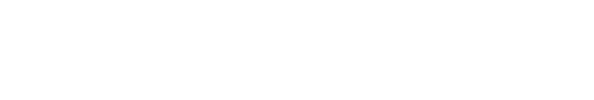
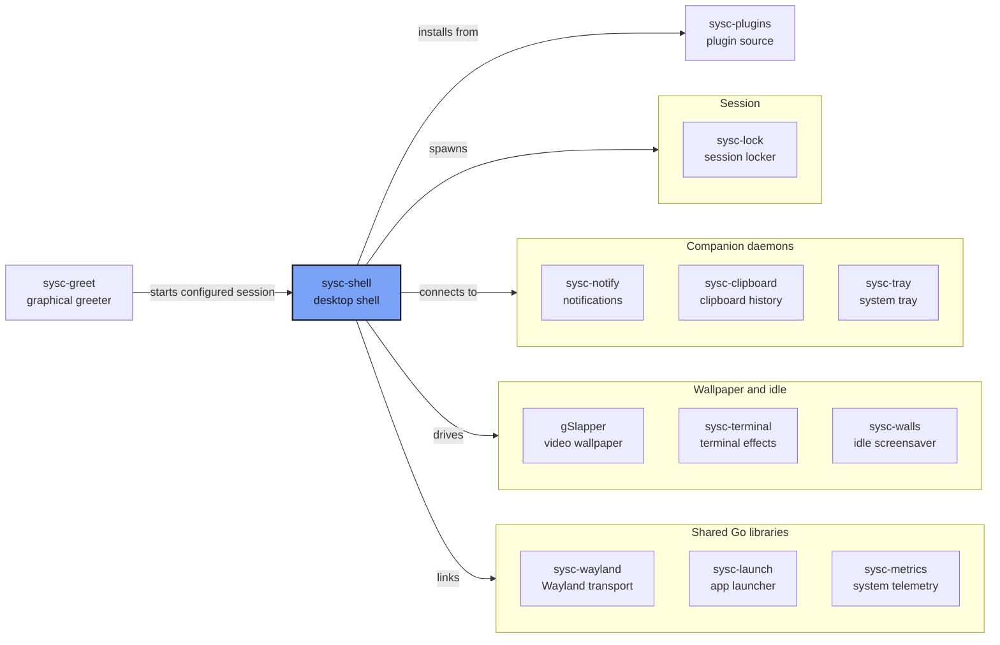

A desktop shell for Niri, written in Go. Bars, panels and OSDs, with separate daemons for
notifications, clipboard history and the system tray.

## Quick Links

- [Documentation](#documentation)
- [The sysc ecosystem](https://github.com/Nomadcxx/sysc-shell/blob/main/docs/ecosystem.md)

## Installation

### Requirements

Go 1.26.4+ and Niri, started as a session (`niri-session`, which is what display managers run) so
systemd knows about your graphical session.

Optional: `matugen` for wallpaper colours, `awww`, `swaybg` or `gSlapper` for wallpapers, and
`wl-clipboard`.

### Build from source

```bash
git clone https://github.com/Nomadcxx/sysc-shell
cd sysc-shell
go build -o ~/.local/bin/sysc-shell ./cmd/sysc-shell
```

### Run as a user service

```bash
install -Dm644 packaging/systemd/sysc-shell.service ~/.config/systemd/user/sysc-shell.service
systemctl --user daemon-reload
systemctl --user enable --now sysc-shell.service
```

The service starts with your Niri session and restarts the shell if it crashes. If your Niri config
already has a `spawn-at-startup` line for sysc-shell, remove it, or you'll get two shells. More
detail in [packaging/systemd](packaging/systemd/README.md).

### Companion daemons

Notifications, the tray and clipboard history each run as their own small daemon, so a crash in one
doesn't take the bar with it. Their state survives a shell restart. The shell works without them;
you just don't get that feature.

- **Notifications** — [sysc-notify](https://github.com/Nomadcxx/sysc-notify#installation). Stop mako,
  dunst or swaync first.
- **Clipboard history** — [sysc-clipboard](https://github.com/Nomadcxx/sysc-clipboard#installation).
- **System tray** — [sysc-tray](https://github.com/Nomadcxx/sysc-tray) `v0.1.0-rc.3`.
- **Session lock** — [sysc-lock](https://github.com/Nomadcxx/sysc-lock), then point the shell at it:

  ```json
  { "session": { "locker": "sysc-lock" } }
  ```

- **Idle screensaver** — [sysc-walls](https://github.com/Nomadcxx/sysc-walls). The shell discovers
  the installed `sysc-walls.service` and configures it from Settings.

### Plugins

```bash
git clone https://github.com/Nomadcxx/sysc-plugins
cd sysc-plugins
make install
```

Then enable them from the plugin manager. See [sysc-plugins](https://github.com/Nomadcxx/sysc-plugins)
for what each one needs.

## Usage

Everything opens from the bar. To open panels from the keyboard, bind `sysc-shell ipc` in your Niri
config:

```kdl
binds {
    Super+Space { spawn "sysc-shell" "ipc" "panel.toggle" "{\"panel\":\"launcher\"}"; }
    Super+X     { spawn "sysc-shell" "ipc" "panel.toggle" "{\"panel\":\"session\"}"; }
    Super+Comma { spawn "sysc-shell" "ipc" "panel.toggle" "{\"panel\":\"settings\"}"; }
    XF86AudioRaiseVolume allow-when-locked { spawn "sysc-shell" "ipc" "osd.step" "{\"kind\":\"audio\",\"action\":\"up\"}"; }
}
```

The panels you can name are `launcher`, `control-center`, `notifications`, `clipboard`, `clock`,
`weather`, `system-monitor`, `session`, `power`, `settings`, `wallpaper`, `audio`, `network`,
`bluetooth`, `terminal-art` and `plugin-store`. `wallpaper` and `terminal-art` are opt-in. The full set of bindings,
including brightness and mute, is in [docs/niri-hotkeys.md](docs/niri-hotkeys.md).

From a terminal:

```bash
sysc-shell ipc status
sysc-shell ipc panel.toggle '{"panel":"control-center"}'
```

Settings are in the settings panel and saved to `$XDG_CONFIG_HOME/sysc-shell/config.json`
(default: `~/.config/sysc-shell/config.json`). Logs go to
`journalctl --user -u sysc-shell`.

## Panels and integrations

The shell draws through `wl_shm` and talks to Niri over its IPC socket.

- **Bars**: one per output, with workspaces, window title, clock, weather, CPU, memory, temperature,
  GPU, disk, network, battery and the system tray
- **Launcher**: fuzzy app search that learns what you open, desktop actions, a calculator and emoji
- **Control centre**: network, Bluetooth, audio, media players, weather and a calendar (via the calendar plugin) in one panel
- **Notifications**: popups and a history centre, fed by [sysc-notify](https://github.com/Nomadcxx/sysc-notify)
- **Clipboard**: browse, restore and pin history kept by [sysc-clipboard](https://github.com/Nomadcxx/sysc-clipboard)
- **System monitor**: live gauges, and a process view grouped by application
- **Session panel**: log out, suspend, reboot and power off, with battery status and power profiles
- **Session lock**: hands the screen to [sysc-lock](https://github.com/Nomadcxx/sysc-lock) and tracks
  it through the lock, including one respawn if it dies while locked
- **OSD**: volume and brightness
- **Theming**: Material 3 colours from your wallpaper through matugen, applied to the shell and, with
  templates, to your other apps
- **Wallpaper**: set it from the shell with awww, swaybg or gSlapper, or paint live terminal effects
  with [sysc-terminal](https://github.com/Nomadcxx/sysc-terminal)
- **Idle screensaver**: [sysc-walls](https://github.com/Nomadcxx/sysc-walls), controlled from Settings
- **Frosted glass**: blurred bars and panels on Niri 26.04 and later
- **Plugins**: a plugin manager and store. The official plugins live in
  [sysc-plugins](https://github.com/Nomadcxx/sysc-plugins)

## Ecosystem



[The sysc ecosystem](docs/ecosystem.md) explains each connection, socket and version pin.

## Documentation

- [The sysc ecosystem](docs/ecosystem.md) — how the projects fit together
- [Niri hotkeys](docs/niri-hotkeys.md)
- [Blur on Niri](docs/niri-blur.md)
- [Metrics widgets and Intel GPU usage](docs/metrics-widgets.md)
- [Running under systemd](packaging/systemd/README.md)
- [Development](docs/development.md)

## License

BSD-3-Clause. [NOTICE](NOTICE) covers the app-theming template catalog.

---

<a href="https://github.com/Nomadcxx"></a> — terminal-native tooling for the linux desktop.
[More projects →](https://github.com/Nomadcxx) · [Sponsor](https://github.com/sponsors/Nomadcxx) ❤️
