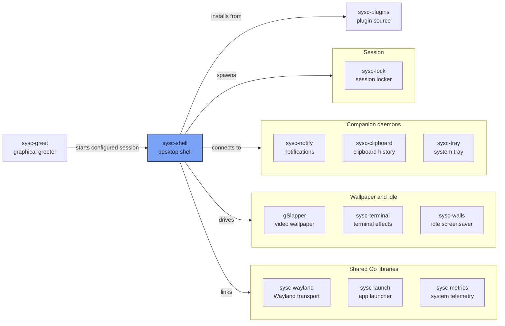

# The sysc ecosystem

sysc-shell is the centre of the project. Everything else either feeds it, runs
beside it, or is a library it links. This page maps those relationships and the
exact interfaces between them.

## How the pieces connect

## Processes the shell starts

The shell starts these wallpaper and locker processes, and runs short-lived clients for service settings.

| Process | Started when | Interface |
|---|---|---|
| [sysc-lock](https://github.com/Nomadcxx/sysc-lock) | Session lock is requested | Spawned as `sysc-lock`; the shell waits for `sysc-lock: locked` on stdout, pauses wallpaper while it runs, and respawns it once if it crashes after acquiring the lock |
| [sysc-terminal](https://github.com/Nomadcxx/sysc-terminal) | Terminal Art wallpaper is selected | One process per output: `sysc-terminal -I $XDG_RUNTIME_DIR/sysc-shell/terminal-<connector>.sock --output <connector> --effect <id> [--theme <theme>] [--file <path>]`. The shell drives it over the socket with `query`, `pause`, `resume`, and `stop`; effect changes restart the process |
| [gSlapper](https://github.com/Nomadcxx/gSlapper) | Video wallpaper is selected | One process per output over a socket the shell owns |
| awww / swaybg | Static image wallpaper is selected | awww runs through `awww-daemon`; swaybg owns its surface directly |
| sysc-walls client | Settings or Control Centre changes idle screensaver options | `sysc-walls-client set <key> <value> ...`; the daemon itself runs as the `sysc-walls.service` user unit |

## Daemons the shell connects to

These run independently of the shell and survive its restarts.

| Daemon | Socket | What it owns |
|---|---|---|
| [sysc-notify](https://github.com/Nomadcxx/sysc-notify) | `$XDG_RUNTIME_DIR/sysc-notify/presenter.v1.sock` | `org.freedesktop.Notifications`; the shell presents and acts on notifications |
| [sysc-clipboard](https://github.com/Nomadcxx/sysc-clipboard) | `$XDG_RUNTIME_DIR/sysc-clipboard/control.v1.sock` | Clipboard history; the shell links its `client` package |
| [sysc-tray](https://github.com/Nomadcxx/sysc-tray) | `$XDG_RUNTIME_DIR/sysc-tray/presenter.v1.sock` | StatusNotifierItem and DBusMenu; the shell links its `protocol` package |

## Libraries the shell links

These are Go modules pinned in `go.mod` and compiled into the shell.

| Module | Role |
|---|---|
| [sysc-wayland](https://github.com/Nomadcxx/sysc-wayland) | Pure-Go Wayland transport and generated protocol bindings |
| [sysc-launch](https://github.com/Nomadcxx/sysc-launch) | Desktop-entry scan, ranking, and usage history, run in-process |
| [sysc-metrics](https://github.com/Nomadcxx/sysc-metrics) | Linux telemetry for the monitoring widgets and process view |
| [sysc-clipboard/client](https://github.com/Nomadcxx/sysc-clipboard) | Clipboard history client |
| [sysc-notify/protocol](https://github.com/Nomadcxx/sysc-notify) | Notification presenter protocol types |
| [sysc-tray/protocol](https://github.com/Nomadcxx/sysc-tray) | Tray presenter protocol types |

## Around the session

| Project | Role |
|---|---|
| [sysc-greet](https://github.com/Nomadcxx/sysc-greet) | Graphical greeter for greetd. It requests the selected session; configure that session to start sysc-shell |
| [sysc-walls](https://github.com/Nomadcxx/sysc-walls) | Idle screensaver. Runs as a user service; the shell reports and controls it |
| [sysc-plugins](https://github.com/Nomadcxx/sysc-plugins) | Plugin source the shell's plugin store installs from |

## Version pins

The shell tracks these revisions in `go.mod`. Nothing is vendored, `replace`
directives are forbidden, and `git diff --exit-code -- go.mod go.sum` is part
of the commit gate.

| Module | Pin |
|---|---|
| sysc-clipboard | `v0.1.2-0.20261001114242-d1798d6838d7` |
| sysc-wayland | `v0.3.1` |
| sysc-launch | `v0.2.1-0.20260928124755-5ccc1d40f3cf` |
| sysc-metrics | `v0.7.0` |
| sysc-notify | `v0.1.0-rc.4.0.20260928141411-254ec5732728` |
| sysc-tray | `v0.1.1` |

## Where to go next

- [README](../README.md) for install and usage
- [development.md](development.md) for the module layout and technology direction
- [niri-hotkeys.md](niri-hotkeys.md) for keybinding examples
- [niri-blur.md](niri-blur.md) for frosted glass
- [metrics-widgets.md](metrics-widgets.md) for the monitoring widgets
