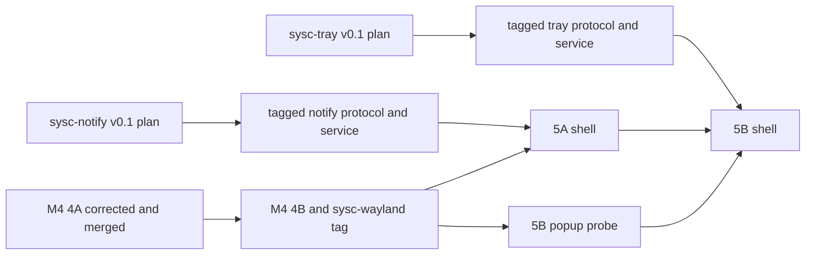

# Milestone 5 Notifications and Tray Audit Report

Date: 2026-08-30
Commission: `docs/plans/2026-08-30-notifications-and-tray-audit-handover.md`
Audit branch: `audit/milestone-5`
Audit worktree: `/home/nomadx/.config/superpowers/worktrees/sysc-shell/audit/milestone-5`
Baseline: `b461548`

## Verdicts

| Tranche | Verdict | Reason |
|---|---|---|
| 5A Notifications | **Redesign required** | The shell and `sysc-notify` both own expiry. The service-owned wire contract, release sequence, and persistence implementation plan do not exist. |
| 5B Tray | **Redesign required** | The service-owned wire contract and release sequence do not exist. Menu requests lack correlation, cancellation, coordinates, and stale-response rules. |

Do not start M5 product code. Commit `8890b3b` fixes mechanical document defects, but it does not settle
the ownership or public-protocol findings below.

## Findings

Findings use the handover's Blocking, Significant, and Minor classes. Each correction names the smallest
change that closes the finding.

### Blocking

#### B1. Both shell plans invent service-owned wire contracts

Evidence:

- `sysc-notify` reserves the first message contract for M0 and describes only a versioned, bounded
  snapshot-plus-change protocol:
  `/home/nomadx/sysc-notify/docs/roadmap.md:5-11` and
  `/home/nomadx/sysc-notify/docs/plans/2026-08-27-sysc-notify-design.md:45-50`.
- The 5A plan defines concrete notification, history, image, event, and command JSON before M0:
  `docs/plans/2026-08-30-notifications-foundation.md:31-104`.
- `sysc-tray` also reserves the snapshot and command contract for M0:
  `/home/nomadx/sysc-tray/docs/roadmap.md:5-12` and
  `/home/nomadx/sysc-tray/docs/plans/2026-08-27-sysc-tray-design.md:45-49`.
- The 5B plan defines concrete item, pixmap, menu, event, and command types first:
  `docs/plans/2026-08-30-tray-foundation.md:43-84`.

Impact: Neither plan can prove framing, socket modes, peer checks, version negotiation, capabilities,
field widths, optional fields, unknown-field behavior, message limits, sequence gaps, resync, or command
results. Independent Go structs will drift even if both first implementations happen to use JSON.

Correction: Each service must publish and test its v1 protocol before its shell task freezes types. The
contract must define the rows in the contract table below. The shell should consume a tagged protocol
package or service-owned conformance fixtures instead of treating the shell plan's examples as the source.
Replace both Task 1 bodies after those contracts land.

#### B2. 5A assigns expiry to two processes

Evidence:

- `sysc-notify` owns expiry and active state:
  `/home/nomadx/sysc-notify/docs/plans/2026-08-27-sysc-notify-design.md:14-19`.
- 5A computes timeout policy, pauses on hover, pauses while queued, and restarts a full duration:
  `docs/plans/2026-08-30-notifications-foundation-design.md:51-52` and
  `docs/plans/2026-08-30-notifications-foundation.md:198-208,251-258`.
- One notification appears on every output, while output height and hover state can differ:
  `docs/plans/2026-08-30-notifications-foundation-design.md:57-61`.

Impact: The service can emit `closed` while one shell card remains paused. The shell can dismiss a card
after the service has expired it. Different outputs can disagree about whether one notification is queued,
visible, or hovered. Reconnect cannot reconstruct remaining presentation time from `expire_timeout`.

Correction: The owner must choose one lifetime contract. A service-owned design needs an authoritative
deadline plus explicit, bounded presentation pause/resume semantics that define zero-client and
multi-output behavior. A shell-owned design would require amending the approved service boundary. After
that decision, one process scheduler must own every card transition; rendering timers only invalidate
while motion or countdown pixels can change.

#### B3. Both service roadmaps create a release dependency cycle

Evidence:

- The shell requires tagged service releases before product work:
  `docs/roadmap.md:182-183`, `docs/plans/2026-08-30-notifications-foundation.md:17-25`, and
  `docs/plans/2026-08-30-tray-foundation.md:16-20`.
- `sysc-notify` schedules shell presentation before its first tag:
  `/home/nomadx/sysc-notify/docs/roadmap.md:31-44`.
- `sysc-tray` combines shell presentation and its first tag in M4:
  `/home/nomadx/sysc-tray/docs/roadmap.md:41-46`.
- Both service repositories contain designs and roadmaps only. Neither has an implementation plan, Go
  module, implementation, or tag.

Impact: The shell cannot start without a tag, while each service roadmap withholds its tag until the shell
integration finishes. The persistence addendum in `sysc-notify` is also uncommitted in that repository.

Correction: Write and review these service plans before shell work:

- `/home/nomadx/sysc-notify/docs/plans/2026-08-30-sysc-notify-v0.1.md`, including M0 through M2,
  persistence, conformance fixtures, and a tagged shell-consumable release;
- `/home/nomadx/sysc-tray/docs/plans/2026-08-30-sysc-tray-v0.1.md`, including M0 through M3,
  conformance fixtures, and a tagged shell-consumable release.

Amend both roadmaps so a tagged service and protocol release precedes shell integration. A later stable tag
may record end-to-end qualification, but the shell must pin a real earlier tag.

#### B4. The persistence copies disagree on clear semantics and only the shell copy has crash safety

Evidence:

- The `sysc-notify` copy says `history.clear` with no active-close effect:
  `/home/nomadx/sysc-notify/docs/plans/2026-08-30-sysc-notify-persistence-design.md:51-61`.
- The shell copy says the same command closes every still-active notification, truncates history, and emits
  `history-cleared`: `docs/plans/2026-08-30-sysc-notify-persistence-design.md:57-67`.
- The service copy specifies only temp-write plus rename and has no schema version, file sync, directory
  sync, quarantine, startup sidecar collection, shared-hash accounting, or private-hint policy:
  `/home/nomadx/sysc-notify/docs/plans/2026-08-30-sysc-notify-persistence-design.md:18-21,44-49,63-76`.
- The audited shell copy now records those requirements:
  `docs/plans/2026-08-30-sysc-notify-persistence-design.md:44-55,69-90`.

Impact: A clear-history click may close live notifications on one implementation and preserve them on
another. A crash can lose the last committed file or leave partial sidecar state. A future schema can get
overwritten. Private notification content has no complete exclusion contract.

Correction: The owner must settle whether clearing closed history also closes active notifications. Move
the authoritative addendum to `sysc-notify`, port the crash-safety corrections from `8890b3b`, commit it
with the service implementation plan, and leave only a link or synchronized excerpt in `sysc-shell`.

#### B5. 5B cannot reject a stale menu response or preserve activation coordinates

Evidence:

- The design sends `menu.open {owner,path}` and receives a revisioned tree with no request identity,
  item generation, cancellation, or reply status:
  `docs/plans/2026-08-30-tray-foundation-design.md:37-43`.
- The plan's `Event`, `Menu`, and `Command` types have no correlation ID, sequence, coordinates, or
  cancellation field: `docs/plans/2026-08-30-tray-foundation.md:61-84`.
- The service design requires stale replies to disappear after owner loss and defines the shell as the
  input owner: `/home/nomadx/sysc-tray/docs/plans/2026-08-27-sysc-tray-design.md:16-18,29-43`.

Impact: A response can open after its item disappears, after a newer item owns the same path, or after the
user opens another menu. Activate, secondary-activate, context-menu, and scroll calls cannot preserve the
event coordinates required by StatusNotifierItem behavior. The shell also cannot match a delayed reply to
the saved Wayland grab serial.

Correction: The service M0 contract must carry `request_id`, unique owner, object path, item generation,
menu revision, success/error, and cancel. Every item action must define its coordinate space and carry the
required x/y or scroll delta/orientation fields. The shell retains the Wayland serial in its state, cancels on
item loss, output loss, service loss, or a newer request, and opens only the matching current reply.

### Significant

#### S1. Image and icon trust boundaries were incomplete

The pre-audit plans decoded files without an encoded-byte or header limit, accepted incomplete raw buffers,
ignored several integer-overflow paths, followed icon names without traversal or symlink containment, and
used an unbounded `(name,size)` cache. Commit `8890b3b` corrected the design and Tasks 2-3:
`docs/plans/2026-08-30-notifications-foundation-design.md:91-109` and
`docs/plans/2026-08-30-notifications-foundation.md:115-174`.

Remaining correction: The service M0 contract must publish the numeric limits that these tests enforce.
The SVG-only theme ceiling remains an owner question because common freedesktop themes use SVG.

#### S2. The popup plan used the wrong Wayland protocol path

The pre-audit 5B plan called nonexistent `xdg_wm_base.get_popup` and tried to create an `xdg_surface` for
the bar's role-bound `wl_surface`. The checked-in protocols require a null-parent xdg popup followed by
`zwlr_layer_surface_v1.get_popup`: `protocols/xdg-shell.xml:76-92,495-507` and
`protocols/wlr-layer-shell-unstable-v1.xml:287-298`. Commit `8890b3b` corrected the sequence, owner-goroutine rule, grab
serial, keyboard restoration, failure cleanup, and two-output probe:
`docs/plans/2026-08-30-tray-foundation-design.md:53-66` and
`docs/plans/2026-08-30-tray-foundation.md:24-41,131-152`.

Remaining correction: Task 1 must run on live Niri before Task 6 selects the popup path.

#### S3. M4 does not supply the auxiliary-surface contract M5 assumes

Evidence:

- M4 `AuxRequest` can open or close only; it cannot change keyboard interactivity on a mapped surface:
  `docs/plans/2026-08-30-panel-foundation.md:845-864`.
- 5A requires None to OnDemand to None without recreating the toast surface:
  `docs/plans/2026-08-30-notifications-foundation.md:263-273`.
- M4 says reload preserves aux surfaces, then later says reload closes them and calls survival deferred:
  `docs/plans/2026-08-30-panel-foundation.md:867-872,1221,1506-1507,1613-1615`.

Impact: Literal M4 execution either cannot implement inline reply and popup keyboard focus, or destroys
open M5 surfaces during reload. M5 cannot compile against a stable named API until M4 resolves this.

Correction: Fix the M4 plan before merge. Add an owner-goroutine aux update command for keyboard and input
region state, and make every reload step preserve mapped aux surfaces. Then update the M5 prerequisites to
name the resulting API rather than `ui.Handle`, which does not exist in current source.

#### S4. Notification actions and content lack an end-to-end capability and bounds contract

Evidence:

- The service roadmap accepts only action and dismiss messages in M2:
  `/home/nomadx/sysc-notify/docs/roadmap.md:22-29`.
- The shell adds inline reply and history clear, but no reply/error envelope or negotiated capability:
  `docs/plans/2026-08-30-notifications-foundation.md:98-104`.
- The service promises bounded strings and action counts without numbers:
  `/home/nomadx/sysc-notify/docs/plans/2026-08-27-sysc-notify-design.md:35-40`.
- The shell sanitizes markup but sets no byte or display limits for summary, body, action labels, reply
  text, URLs, or decoded entities: `docs/plans/2026-08-30-notifications-foundation.md:198-208`.

Impact: The shell can allocate or lay out unbounded content from a compromised or newer service. It cannot
know whether default action, inline reply, history, images, or value progress work end to end.

Correction: The notify M0 contract must publish numeric byte/display/action limits, command results,
default-action and inline-reply semantics, close reasons, and capabilities. The shell must enforce equal or
lower limits after decoding and define unknown capability and unknown field behavior.

#### S5. 5A has no central lifetime, animation, and cleanup state machine

Evidence:

- Tasks 7-9 distribute queueing, render motion, hover timers, swipe, action, and reply cleanup across one
  host file: `docs/plans/2026-08-30-notifications-foundation.md:236-275`.
- The inline-reply task restores keyboard only on submit, blur, or close. The handover also requires
  dismissal, output removal, and service loss.
- The gate checks reduced motion but not idle rendering or one-scheduler behavior:
  `docs/plans/2026-08-30-notifications-foundation.md:319-326`.

Impact: Per-card timers or animation goroutines can accumulate. Service loss and output hotplug can leave
keyboard OnDemand or a stale focused field. Countdown rendering can turn into a continuous frame loop.

Correction: Add one pure notification state-machine task and one process scheduler. Enumerate every state
transition and cleanup event before the surface/render tasks. Tests must prove zero redraws at idle,
bounded invalidation during motion, and keyboard release on every exit path.

#### S6. PID reuse and `/proc` races can change focus behavior

Evidence:

- The service may capture numeric parent PIDs from `/proc`:
  `/home/nomadx/sysc-notify/docs/plans/2026-08-27-sysc-notify-design.md:42-43`.
- The shell matcher compares only integers and stores the result until activation:
  `docs/plans/2026-08-30-notifications-foundation.md:277-289`.

Impact: A process can exit during lineage capture, a PID can refer to another process later, or the mapped
Niri window can disappear before action. None should change action invocation, and all uncertainty should
disable focus.

Correction: The service plan must define best-effort lineage capture and a stable process-instance marker
such as `/proc/<pid>/stat` start time when available. The shell must bind the match to the current Niri
window ID, drop it on window close or PID mismatch, invoke the notification action regardless of focus
failure, and treat every read/permission/reuse ambiguity as no focus.

#### S7. The menu model has no hostile-tree decoder, and the fallback control is too small

Evidence:

- The tray service requires limits for depth, nodes, strings, pixmaps, maps, and update rate:
  `/home/nomadx/sysc-tray/docs/plans/2026-08-27-sysc-tray-design.md:36-43`.
- 5B embeds recursive `Children` with no bounds, cycle detection, parent validation, or rate handling:
  `docs/plans/2026-08-30-tray-foundation.md:61-71,131-152`.
- M4 `KindMenu` is a string-option settings dropdown, not a DBusMenu tree with separators, enabled state,
  toggles, icons, and submenu identity:
  `docs/plans/2026-08-30-settings-osd-theme-catalog.md:107-138`.

Impact: A malformed tree can exhaust stack, memory, layout, or repaint work. The named fallback cannot
render the promised menu semantics without a second menu model hidden inside Task 6.

Correction: Put an iterative, bounded DBusMenu decoder and normalized model in its own task. Reject cycles,
duplicate or invalid parent IDs, excessive depth/nodes/strings/icons, and update floods. Reuse M4's panel,
focus, painting, and menu-row vocabulary, but do not claim the settings dropdown itself covers DBusMenu.

#### S8. Tray layout and action tests do not cover per-output behavior

Evidence:

- The bar widget task tests only item count, one insufficient width, and basic clicks:
  `docs/plans/2026-08-30-tray-foundation.md:118-129`.
- The gate lacks output add/remove, mixed scale, transform, and two-output overflow movement:
  `docs/plans/2026-08-30-tray-foundation.md:166-181`.
- The design says right click falls back to secondary activate when no menu; Task 5 always sends
  `menu.open`: `docs/plans/2026-08-30-tray-foundation-design.md:18-22` and
  `docs/plans/2026-08-30-tray-foundation.md:124-125`.

Impact: One output can duplicate an activation target in both bar and drawer, use the wrong icon scale, or
lose attention state after hotplug. A menu-less right click can become a no-op.

Correction: Add per-output table tests for scale, transform, width, hotplug, and connector reuse. Assert an
item has one target per output location, moves between inline and drawer without duplication, keeps
attention/overlay state, and follows the agreed left/middle/right/wheel contract with coordinates.

#### S9. IPC callbacks and command writes have no bounded goroutine handoff

Evidence:

- The notify client invokes `OnSnapshot` and `OnEvent` callbacks from its dial loop and exposes `Send`
  without queue, serialization, cancellation, or ownership rules:
  `docs/plans/2026-08-30-notifications-foundation.md:175-194`.
- The tray client says only "same peer-cred and backoff" and exposes several sends:
  `docs/plans/2026-08-30-tray-foundation.md:90-98`.
- The shell keeps every Wayland proxy on one goroutine:
  `internal/platform/wayland/client.go:109-110`.

Impact: A service reader can mutate shell presentation state or reach Wayland through a callback. Concurrent user
commands can interleave writes. An unbounded callback or send queue can let a slow shell retain service
messages after resync or shutdown.

Correction: Each client publishes immutable decoded messages into one bounded shell-owned queue. The
Wayland owner consumes presentation commands; no IPC goroutine touches a proxy. One writer serializes
commands with context cancellation and bounded backpressure. Snapshot replacement discards queued deltas
from the old connection generation.

### Minor

#### M1. The designs labeled tranche rules as owner decisions D15-D22

The locked research stops at D14: `docs/plans/2026-08-30-notifications-and-tray-research.md:12-29`.
Commit `8890b3b` renamed the extra rows to 5A-1 through 5A-5 and 5B-1 through 5B-3.

#### M2. Raw-image JSON tags collided

The pre-audit `RawImage` declaration assigned `json:"width"` to width, height, and stride and
`json:"bits"` to bits and channels, then deferred the fix to a test. Commit `8890b3b` gave each field its
own tag at `docs/plans/2026-08-30-notifications-foundation.md:66-77`.

## Cross-repository contract table

The service owns every wire row. Shell documents may describe consumption, but they cannot define a
different field set.

| Contract | Owner and source | Current shell assumption | Audit result |
|---|---|---|---|
| Notify socket path, directory/socket modes, server owner, peer UID checks | `sysc-notify` M0; design only at `/home/nomadx/sysc-notify/docs/plans/2026-08-27-sysc-notify-design.md:45-50` | `$XDG_RUNTIME_DIR/sysc-notify/ipc.v1.sock`, UID check | **Missing** exact ownership and modes |
| Tray socket path, modes, owner, peer UID checks | `sysc-tray` M0; design at `/home/nomadx/sysc-tray/docs/plans/2026-08-27-sysc-tray-design.md:45-52` | `$XDG_RUNTIME_DIR/sysc-tray/ipc.v1.sock`, same client as notify | **Missing** exact ownership and modes |
| Handshake, protocol version, capabilities, reject/downgrade behavior | Each service M0 | Filename version only; no handshake types | **Missing** |
| Framing, encoded limit, decoded limit, partial read, unknown JSON fields | Each service M0 | Notify chooses newline JSON and 1 MiB scanner; tray framing is unstated | **Missing** and shell must not choose first |
| Snapshot sequence, delta sequence, gap detection, snapshot replacement | Each service M0/M2 | Snapshot then events with no sequence | **Missing** |
| Notify active identity and fields | `sysc-notify` M0 | Shell Task 1 fields at `docs/plans/2026-08-30-notifications-foundation.md:50-65` | **Invented by shell** |
| Notify actions, dismiss, close reasons, default action, inline reply | `sysc-notify` M0/M2 | Four string command names, no replies | **Missing** inline-reply and result contract |
| Notification image and value hint bounds | `sysc-notify` M0 | Raw bytes in JSON, pointer value | **Missing** numeric limits and capability |
| History entry, active/history separation, clear semantics, schema capability | `sysc-notify` persistence plan | Two addendum copies disagree | **Blocking**, B4 |
| Sender process identity and lineage | `sysc-notify` M0 | PID plus parent PID integers | **Incomplete**, S6 |
| Tray item identity and property fields | `sysc-tray` M0/M2 | Unique owner plus path, full replacement item | Identity held; field/delta contract **missing** |
| Pixmap byte order, dimensions, scale, limits, malformed isolation | `sysc-tray` M0 | `W,H,ARGB []byte` | **Missing** byte order and numeric limits |
| Activate, secondary, context menu, and scroll coordinates | `sysc-tray` M0/M1 | Type, owner, path, delta, orientation | **Missing**, B5 |
| Menu request/reply/cancel, item generation, revision, events | `sysc-tray` M0/M3 | `menu.open`, one uncorrelated `menu` event | **Missing**, B5 |
| Menu depth, node/string/icon limits, cycles, update rate | `sysc-tray` M0/M3 | Recursive children with no decoder limits | **Missing**, S7 |
| Zero clients, slow client, bounded queue, reconnect cancellation/backoff | Each service design | Fixed 1 s notify retry; no queue or cancellation contract | Zero-client rule held; mechanics **missing** |

Persistence adds `history[]`, history events, `history.clear`, and a capability. Because no byte protocol
version exists, the audit cannot call this v1-compatible or require v2. The service M0 plan must decide
that before the first tag. An old shell may ignore unknown fields only if the contract says it may; new
event kinds and commands still need capability negotiation.

## Dependency graph and merge order

Merge order:

1. Correct and merge M4 4A, then 4B and its tagged `sysc-wayland` bindings.
2. Commit the authoritative notify addendum and `sysc-notify-v0.1` plan. Implement M0-M2 plus
   persistence, run service tests, and tag a shell-consumable release.
3. Implement and merge 5A after replacing its invented protocol types with the tagged contract. Tasks 2-3
   may run after M4 while the service work proceeds.
4. In parallel with steps 2-3, write and execute `sysc-tray-v0.1`, then tag its protocol/service release.
5. Run the corrected two-output popup probe after M4. Record only pass/fallback, with machine details kept
   outside Git.
6. Implement and merge 5B after 5A, the tray tag, and the popup-path decision all exist.

This order removes the current service-tag cycle. It also prevents 5B from modifying `internal/icons`
while 5A still owns that package.

## Task count and file overlap

### 5A

The 13 headings contain several independent commit boundaries:

| Current task | Split needed |
|---|---|
| Task 1 | Service protocol conformance/types; sequence state machine; command results and capability tests |
| Task 4 | Socket lifecycle and peer validation; snapshot/delta resync; bounded outgoing commands and cancellation |
| Task 5 | Markup sanitizer; authoritative lifetime policy after B2 |
| Task 7 | Notification state projection; aux-surface lifecycle; renderer/motion |
| Task 8 | Action/dismiss routing; swipe/hover transitions |
| Task 9 | M4 aux keyboard update; reply field and submit/cancel cleanup |
| Task 12 | Center list/grouping; search/focus; DND/clear commands |
| Task 13 | Process wiring; automated gate; live gate |

Tasks 2, 3, 6, 10, and 11 can remain focused after the applied corrections, although Task 11 should use one
deadline timer instead of a 1 s polling ticker. The final count should follow red-green boundaries rather
than preserve 13.

### 5B

| Current task | Split needed |
|---|---|
| Task 2 | Service protocol conformance/types; bounded item/menu decode |
| Task 3 | Socket lifecycle; ordered item resync; correlated command/reply cancellation |
| Task 5 | Per-output fit/overflow model; action routing and coordinates; widget render |
| Task 6 | Wayland popup transport; DBusMenu model/validation; keyboard/pointer host; fallback adapter |
| Task 8 | Process wiring; automated restart/gap gate; two-output live gate |

Task 1 remains a hard gate. Tasks 4 and 7 can remain focused after the menu and overflow models exist.

### Shared files and branches

| File or area | Writers | Required order |
|---|---|---|
| `internal/platform/wayland` aux/input/popup state | unfinished M4, 5A Task 9, 5B Task 6 | M4 first; 5A dynamic aux update; 5B popup child |
| `internal/shell/registry.go` | unfinished M4, 5A Task 7, 5B wiring | M4, then 5A, then 5B |
| `cmd/sysc-shell/main.go` | unfinished M4, 5A Task 13, 5B Task 8 | same order |
| panel IDs and focus ownership | M4, 5A center, 5B menu/drawer | settle one-open-panel behavior before 5A |
| `internal/icons` | 5A Tasks 2-3, consumed by 5B Task 4 | 5A owns; 5B does not fork or duplicate |
| protocol types and fixtures | each service plus shell | service commits and tags first; shell consumes |
| notify persistence addendum | duplicate shell/service copies | `sysc-notify` becomes authoritative |

The primary `sysc-shell` checkout had unrelated edits in `internal/render/canvas.go` and untracked
`internal/render/mask.go` plus `mask_test.go`. The audit did not touch them.

## Missing automated and live evidence

| Required evidence | Current plan coverage | Required addition |
|---|---|---|
| Hostile, partial, truncated, oversized, and unknown wire messages | Oversized notify line only | Shared service/shell conformance table for both protocols |
| Sequence gap followed by snapshot replacement | None | Gap forces disconnect/resnapshot; stale deltas cannot mutate replacement state |
| Service loss during action, reply, menu, and image decode | Partial restart checklist | Automated cancellation and stale-result tests for each operation |
| Image, icon, markup, content, action, reply, menu, queue limits | Image/icon corrected; others absent | Numeric boundary tables plus one-over tests |
| Output add/remove, scale, transform, connector reuse, reconnect | M5 gate mostly single-output | Fake compositor matrix and two-output live checks |
| Keyboard focus and pointer routing | Happy paths only | Every dismissal, reload, output loss, service loss, and fallback path |
| Reduced motion and idle rendering | Reduced-motion assertion only | No animation ticker under reduced motion; zero idle redraws; bounded countdown invalidation |
| Persistence crash recovery, modes, corrupt/future schema, sidecar GC | Corrected design only | Required service implementation tests before tag |
| Popup success and fallback selection | Corrected Task 1, not run | Live two-output result before Task 6 |
| Zero presentation clients | Service prose and live checklist | Private-bus tests that `Notify` and tray registration remain nonblocking |
| Release compatibility | None | Tag-based cross-repository contract tests with no local replacement |

The audit ran `go test ./...` on the clean shell baseline and every package passed. It ran no live Niri
mutation because Task 1 requires future M4 bar and popup product machinery; this audit did not implement
that machinery.

## Edits made during the audit

Commit `8890b3b` (`docs: correct mechanical M5 audit defects`) changed five M5 documents:

- fixed raw-image JSON tags and added complete image/icon limit, traversal, symlink, scale, theme, and
  bounded-cache requirements;
- made the persistence tag a real 5A gate;
- added persistence schema, durable atomic-write, permission, quarantine, and sidecar-GC requirements;
- corrected the layer-shell popup protocol sequence, Wayland owner rule, input serial, keyboard cleanup,
  and two-output probe;
- renamed tranche-local rules that had been presented as owner decisions beyond D14.

The audit changed no product code and did not touch `sysc-notify` or `sysc-tray`. The commit used
`--no-verify` because the repository pre-commit hook runs `bd sync --flush-only`, while the commission
forbids running `bd` from the audit worktree.

## Owner decisions required

1. **Notification lifetime:** How does service-owned expiry coexist with hover pause, per-output overflow,
   center-open pause, DND, zero clients, and reconnect?
2. **History clear:** Does `history.clear` preserve active notifications or close them as Dismissed?
3. **Release sequence:** Which tagged pre-integration version may the shell pin before final end-to-end
   qualification?
4. **Private persistence:** Which freedesktop or vendor hints count as private/sensitive and must never
   reach disk?
5. **SVG parity:** Does D1 require SVG-only theme icons in M5, or may 5A ship bounded raster lookup with a
   fallback until an approved rasterizer lands?
6. **Panel focus ownership:** May notification center, tray drawer, tray-menu fallback, settings, and other
   M4 panels coexist, or does opening one close the currently open panel process-wide?

No other D1-D14 product decision needs reopening. The remaining protocol details belong to the service M0
plans once the six owner questions above are answered.
