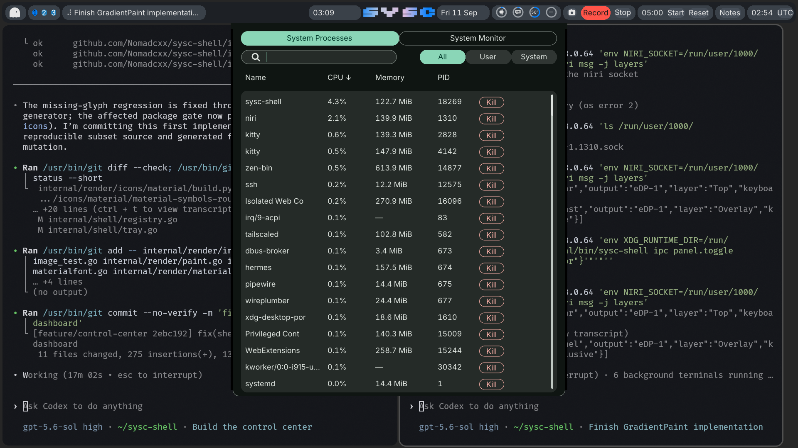

# Shell surface polish execution handover

Date: 2026-09-11.

This handover commissions the visual correction that follows the live system-monitor review. The
process table and sysmon gauges are accepted. The next pass removes the process-list scrollbar,
smooths shared rounded chrome, adds restrained theme-derived button gradients, fixes the attached
panel silhouette, and makes an attached panel use the same resolved root colour as its bar.

The governing product decisions remain in
`2026-09-08-live-shell-correction-design.md`. The shared attached-surface diagnosis and correction are
specified in `2026-09-10-control-center-dashboard-correction-design.md` D6-D8 and planned in
`2026-09-11-control-center-dashboard-correction.md`. The 2026-09-11 parity tranche now owns the later
token, control-geometry, opacity, and frame-pacing changes. The coordination notes below keep this
pass inside those boundaries.

## Receiving state

The accepted product baseline is `9cac238` (`fix(shell): align process table columns`). Eleven
planning and tracking commits follow it on `main`, ending at `2dd478a`; they add the network/media
plans and the parity tranche without changing the tested binary. The current process table is the
result of these commits:

| Commit | Result |
|---|---|
| `8f4755f` | Antialiased gradient radial gauge arcs. |
| `a2de635` | First compact process-table pass. |
| `7cdfb25`, `38835bd` | Approved flat-table design and 26/32 row geometry amendment. |
| `b4bc7db` | One shared table surface, flat rows, compact Kill control, and virtual-row pitch fix. |
| `9cac238` | Header cells use the same fixed column tracks as process values. |

The owner tested the deployed table and confirmed that it works. Keep the accepted structure:

- one rounded `FillContainerHigh` table surface;
- transparent resting rows, with flat full-row hover, press, focus, and selection washes;
- 26 px rows centred on a 32 px pitch;
- aligned Name, CPU, Memory, PID, and Kill columns;
- one 48 by 22 px outlined Kill control which sends `SIGTERM` after the existing PID/start-time check;
- search, filtering, sorting, wheel and touchpad scrolling, keyboard focus reveal, and virtualisation.

The owner also accepted the four 22 px bar gauges. Keep their sizes, custom CPU/memory/GPU glyphs,
analytic ring coverage, theme gradients, temperature thresholds, and tooltips.

The primary checkout has one unrelated untracked directory, `.cursor/`. Leave it alone. The prior-art
document at `docs/plans/2026-09-06-connectivity-and-media-prior-art.md` and the beads JSONL are tracked;
neither carries pending state for this handover.

The separate `feature/control-center` worktree is active at `b21a11e`, based on `bb77b9b`. Its last
commit already implements the shared fillet correction: `panelSpec` suppresses the false full-surface
opaque hint when a fillet expands the buffer, `fillAttachFillets` uses partial-alpha coverage, and
focused tests cover the policy and curve. That commit is not on `main` and has not passed this
handover's live gate. Integrate the control-centre branch before changing those owners; do not create
a second fillet implementation for the process panel.

## Coordination with the parity tranche

Read these documents before making the polish branch. They settle adjacent work and avoid a second
set of constants or renderer mechanisms:

| Document | Owner boundary for this pass |
|---|---|
| `2026-09-11-noctalia-parity-design.md` and `2026-09-11-noctalia-parity.md` | Own the later rebase of spacing, container/input radii, type, density, motion, and semantic colour roles. Rebase onto them if they land first. Do not copy today's resolved sizes or RGB values into the polish. |
| `2026-09-11-component-parity-design.md` | Owns derived control proportions and per-surface padding. The accepted 26/32 process rows, column tracks, 22 px gauges, and 48 by 22 px Kill action remain locked by this live review unless the owner reopens them. This pass changes their paint finish, not their geometry. |
| `2026-09-11-token-conformance-design.md` | Joins the parity plan as its first task. Any geometry touched by a rebase must use the resolved ladders or a reasoned `token-exempt:` marker; this pass should need no new geometry literal. |
| `2026-09-11-rendering-smoothness-design.md` and `2026-09-11-rendering-smoothness.md` | Own rectangle damage, animation pacing, and wallpaper-thumbnail coalescing. Button gradients in this pass stay static and request no frames. Do not pull damage tracking into this branch. |
| `2026-09-11-panel-backdrop-blur-design.md` | Owns screencopy blur and the lower panel-opacity floor. Until blur lands, an attached panel and bar must resolve the same base root colour and composited no-backdrop fill. With blur enabled later, they keep the same semantic base colour while that design controls panel opacity and backdrop composition. |

The shared renderer change for rounded chrome remains valid before or after the token rebase because
it consumes the resolved `Style`. Calibrate the button gradient after rebasing if both branches meet;
the new role values will change its visible strength.

## Pixel baseline

The laptop capture below is from the exact binary deployed to the laptop and bare metal, SHA-256
`b9aa698e9049ed6696b92b8b8eb5d0eb9665dea04161b288ae96dc7ac2d24e69`.
The laptop binary ran as PID 18269 when recorded. The capture is 1920 by 1080 physical pixels on
`eDP-1`; Niri reported the bar, shield, and panel layer surfaces mapped.



The DMS reference remains
`assets/2026-08-31-bar-visual-parity/refs/dms-process-element.png`. Match its clarity and restrained
surface hierarchy, while keeping the denser row geometry the owner accepted.

Pixel samples from the current capture show the defects without relying on visual memory:

| Sample | RGB |
|---|---:|
| visible bar root at `(540,30)` | `29,32,37` |
| visible bar pill at `(300,30)` | `58,65,73` |
| process panel root at `(565,200)` | `15,21,18` |
| process table surface at `(600,240)` | `37,43,40` |
| expanded panel side margin at `(556,300)` | `0,0,0` |

The black side-margin sample is the reported silhouette defect. The bar and panel samples also show
the current theme mismatch on the same output.

## Required visual behaviour

### Process-list scrolling

Hide the scrollbar on the process virtual list. Keep the scrollbar on other scroll views unless
their designs say otherwise. The hidden process scrollbar must not leave an invisible draggable or
clickable strip over the Kill column.

The existing input path already supports wheel and touchpad axes, Up and Down roving focus with
`revealFocusedProcess`, Home, End, Page Up, and Page Down. Hiding the chrome must leave those paths
unchanged. The narrow fitting seam is a per-scroll-node presentation flag used by both
`paintScrollThumb` and `ui.ScrollTrack`; changing only the painter would retain the invisible track.

Relevant code:

- `internal/shell/popout_process.go`: constructs the process `KindVirtualList`;
- `internal/render/paint.go:288-392`: clips scroll contents and paints the thumb;
- `internal/ui/scroll.go:27-78`: exposes the pointer track and maps track position to offset;
- `internal/shell/panelhost.go:850-1110`: pointer drag, wheel, keyboard paging, and focus reveal.

### Rounded chrome and button finish

The panel body and its rim already use cached antialiased masks through `Canvas.FillRounded` and
`Canvas.StrokeRounded`. Nested buttons, capsules, their state layers, and scrollbar chrome still use
the integer scanline `fillRoundedRect` path in `paintChrome`. That difference is why small controls
look rough while the radial rings and root border look smooth.

Move shared nested rounded fills and state layers onto the existing cached coverage mask. Keep solid
rectangles, process-row washes, and clipping on their current cheap paths. Make this renderer change
without adding a UI toolkit or dependency.

Buttons must retain their full interaction language: resting, hover, press, selected, disabled,
keyboard focus, outlined destructive action, and accessible foreground. Keep the compact process
Kill button outlined and error-toned. The Name, CPU, Memory, and PID sort labels stay plain table
labels; do not turn them into pills.

### Theme-derived gradients

Add a quiet static gradient to filled button chrome, with the clearest use on the two top page
selectors and selected filter controls. Outline-only controls, including Kill, stay transparent.
Derive every colour from the resolved theme. Do not add fixed purple, blue, green, amber, or red.

Reuse `ui.GradientPaint`, `resolveGradient`, `blendMaskGradient`, and the rounded alpha mask. Extend
`paintChrome` so a declared gradient fills the same rounded silhouette as the solid path. Keep the
solid path as the zero-value behaviour. A selected button still needs a foreground that meets the
theme contrast requirement across the whole ramp.

Use a small tint range. A suitable first calibration blends the resolved solid button fill about
8-12 percent toward Secondary at one end and 4-8 percent toward Primary at the other. Judge the
result on both live themes before fixing the exact values. The gradient does not animate and adds no
frame scheduling.

### Attached panel silhouette

The black pixels have a known structural cause. `panelSpec` widens an attached surface by two fillet
margins, but it passes `OpaqueBackground: h.theme.BackgroundOpaque()`. The Wayland owner then builds
its opaque region from the full auxiliary surface bounds. The transparent side margins are declared
opaque and composite as black.

The dashboard correction specifies the global repair:

- a fillet-expanded panel submits no opaque-region hint;
- `fillAttachFillets` uses analytic per-pixel coverage instead of integer scanline extents;
- the far corners keep the existing rounded mask and rim;
- tests cover 1.0, 1.2, 1.25, and 1.5 output scales.

`feature/control-center` commit `b21a11e` implements the opaque-hint policy and partial-alpha curve
with focused renderer and panel-spec tests. Treat the four-scale matrix as part of integration
verification rather than as proof already supplied by that commit.

Land that shared correction once through the control-centre integration. Rebase it against the
accepted monitor work, run its focused tests, then use the live pixel gate below to decide whether
any follow-up belongs in `internal/shell/panelhost.go`, `internal/platform/wayland/regions.go`, or
`internal/render/canvas.go`.

### Bar and panel theme consistency

Without a captured backdrop, an attached panel must use the bar on that output as its base root-colour
source, including the opacity that determines the final composited colour. A theme reload must update
both from the same token and configuration snapshot. The backdrop-blur design may lower panel opacity
only when it supplies the backdrop that makes that composition readable. Detached panels retain the
separate panel-opacity axis where the governing theme design requires it.

Do not solve the mismatch with a copied RGB value. Trace the two current resolver paths:

- `Registry.buildBar` constructs bars with `ThemeFromTokens(tok, cfg.Theme.Radius)` and connector
  geometry;
- `Registry.panelTheme` constructs panels with `ResolveTheme(r.cfg, r.cfg.Bar, r.tokens)`;
- `Theme.PanelStyle` changes the surface opacity and supplies the bar root fill for fillets.

Those paths can disagree about composition and connector policy. Resolve both surfaces from the same
output-scoped input and let the bar and attached panel project their roles from it. In the no-backdrop
case, the attached panel's root fill should compare equal to that bar's `Style().RootFill()` in a
focused test. Preserve theme roles, high-contrast behaviour, per-output font selection, and live
reload. Do not add another theme setting.

## Proof expected from the continuation

The smallest useful checks cover these invariants:

- a hidden process scrollbar paints no pixels and exposes no `ScrollTrack`, while wheel, Page Down,
  and focus reveal still change the virtual-list offset;
- rounded button fill and hover coverage contain partial-alpha edge pixels at fractional scale;
- a button gradient stays inside the rounded mask, uses semantic theme colours, preserves text
  contrast, and leaves zero-gradient nodes unchanged;
- the integrated `b21a11e` fillet correction publishes no false opaque region and its joint curve
  contains partial coverage without black side pixels;
- an attached panel and its output bar resolve the same no-backdrop root fill before and after a
  theme reload; a later blur-enabled case keeps the same semantic base colour.

Then run the repository gate:

```bash
gofmt -w .
gofmt -l .
GOCACHE=/tmp/go-cache-sysc-shell go vet ./...
GOCACHE=/tmp/go-cache-sysc-shell go test -race -count=1 ./...
git diff --exit-code -- go.mod go.sum
```

The live gate must use real pixels. On both machines, open the process panel, scroll with wheel and
keyboard, change pages and filters, select a harmless process, and capture the bar-panel join at its
native scale. The acceptance image has no visible scrollbar, no invisible track intercepting Kill,
smooth rounded controls, a restrained theme-consistent gradient, no black pixels outside the panel
border, and one root colour across the attached bar and panel.

The laptop is `ssh -p 7777 nomadx@192.168.0.64`. Its shell runs as a user service. Discover the live
Niri socket instead of copying an old PID suffix:

```bash
ls /run/user/1000/niri.wayland-*.sock
env WAYLAND_DISPLAY=wayland-1 XDG_RUNTIME_DIR=/run/user/1000 grim -t png /tmp/sysc-polish.png
env XDG_RUNTIME_DIR=/run/user/1000 ~/.local/bin/sysc-shell ipc panel.toggle '{"panel":"system-monitor"}'
```

Deploy fresh binaries directly. The owner does not want backup copies or deployment ceremony.

## Tracking and scope

Use `sysc-121` for the monitor-panel reference gap and `sysc-54` for the sysmon/bar presentation.
Do not create a parallel issue tree. Run `bd` only from `/home/nomadx/sysc-shell` and preserve any
pre-existing staged JSONL state.

This pass adds no dependency, plugin JSON field, general-purpose surface system, new colour axis, or
new animation clock. Stop when the five live defects in this handover pass on the laptop and bare
metal. Further control-centre page work remains with `sysc-154` and its committed correction plan.
