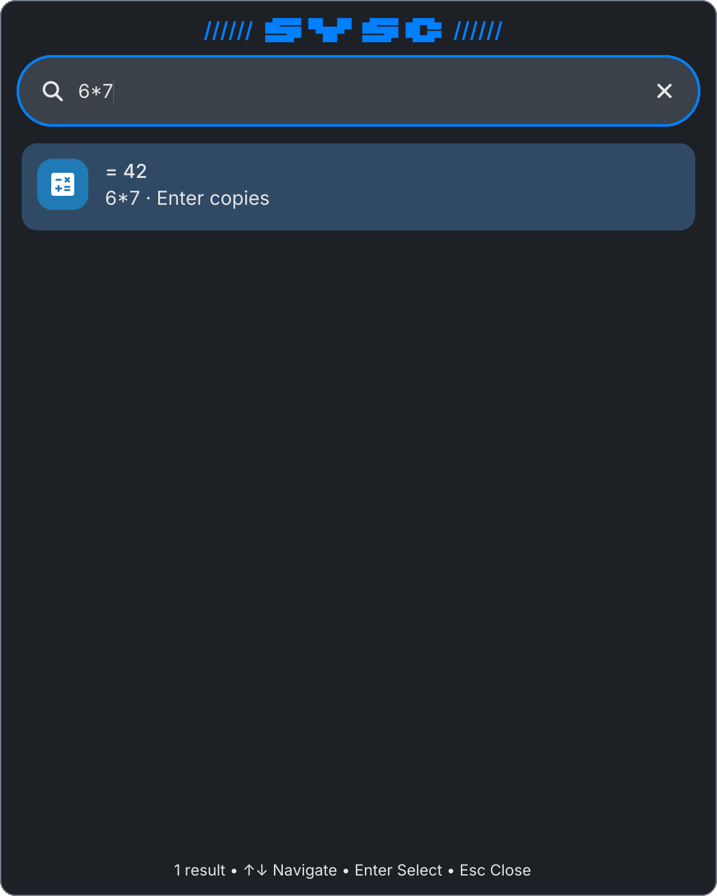
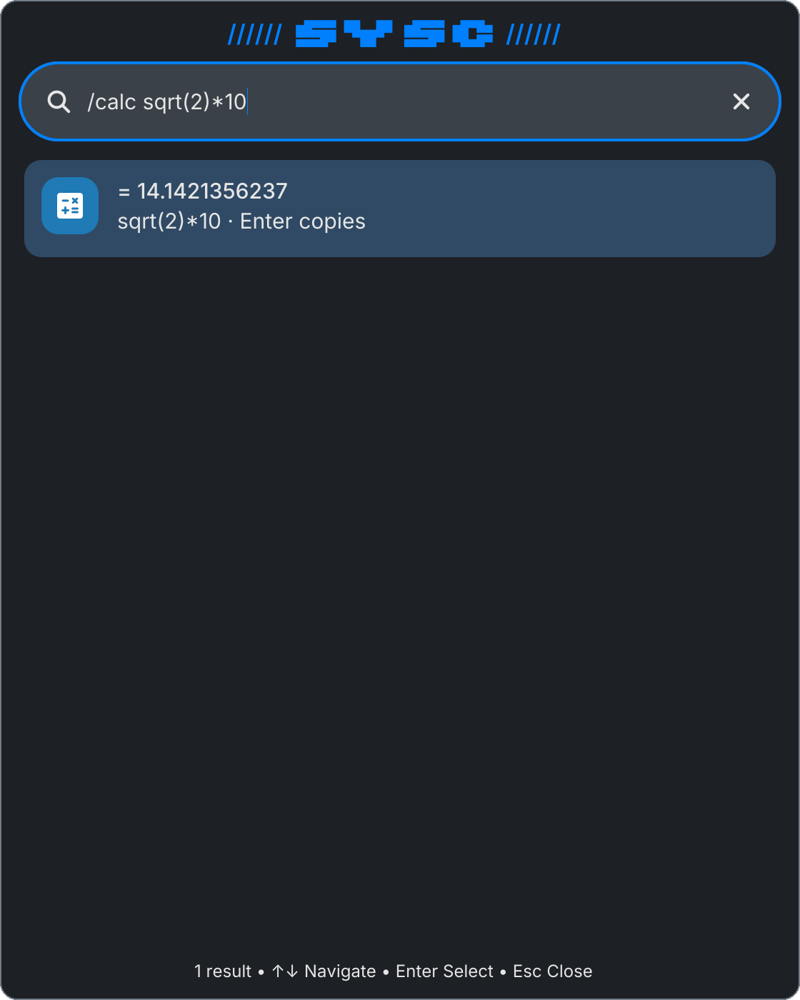
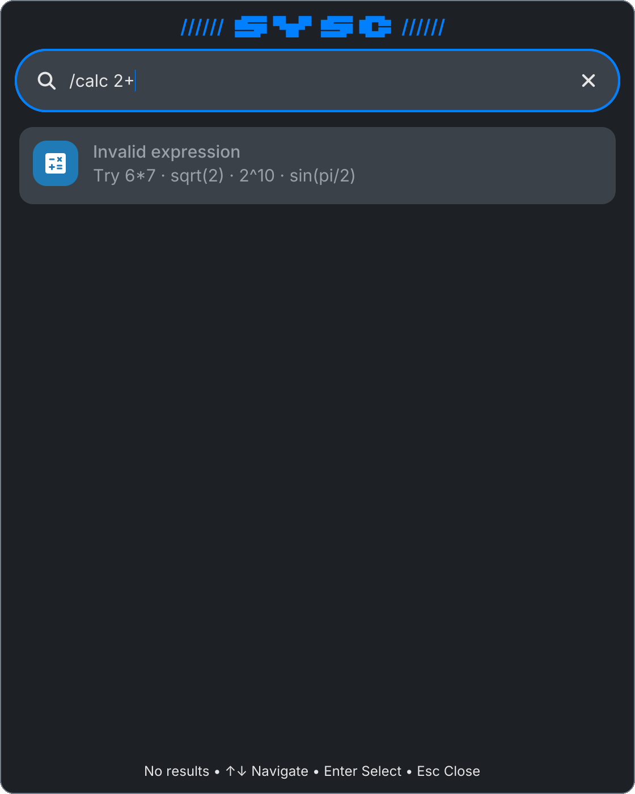
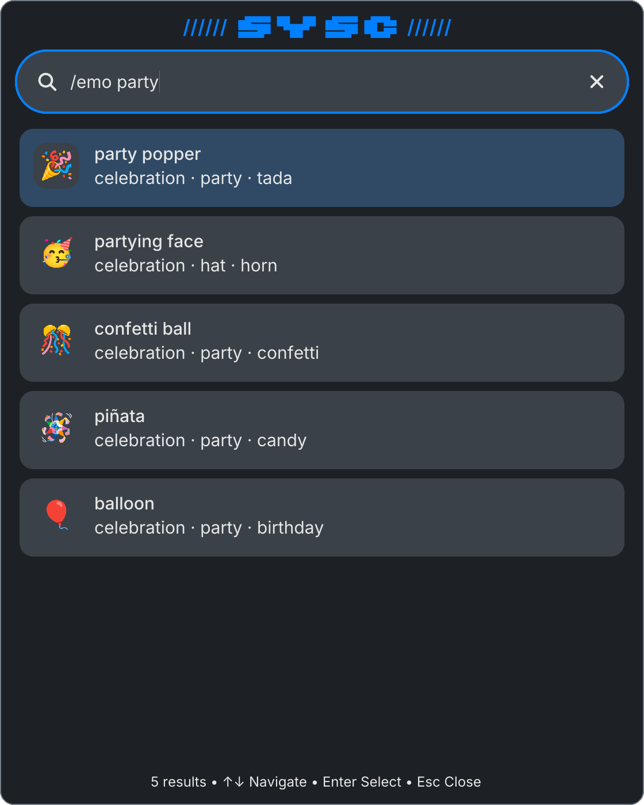
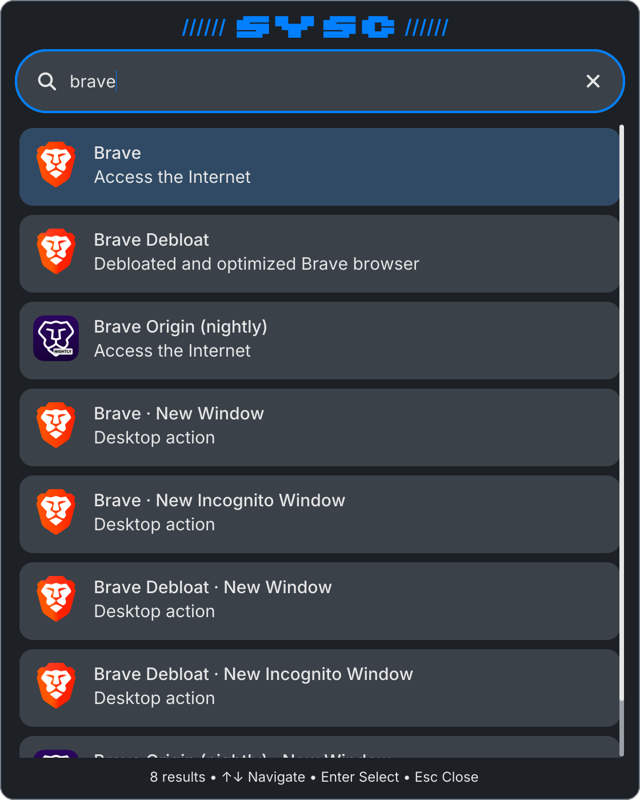
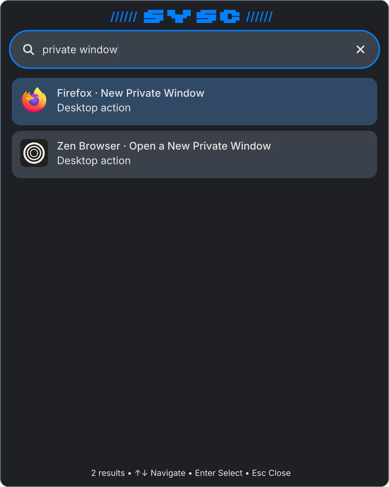
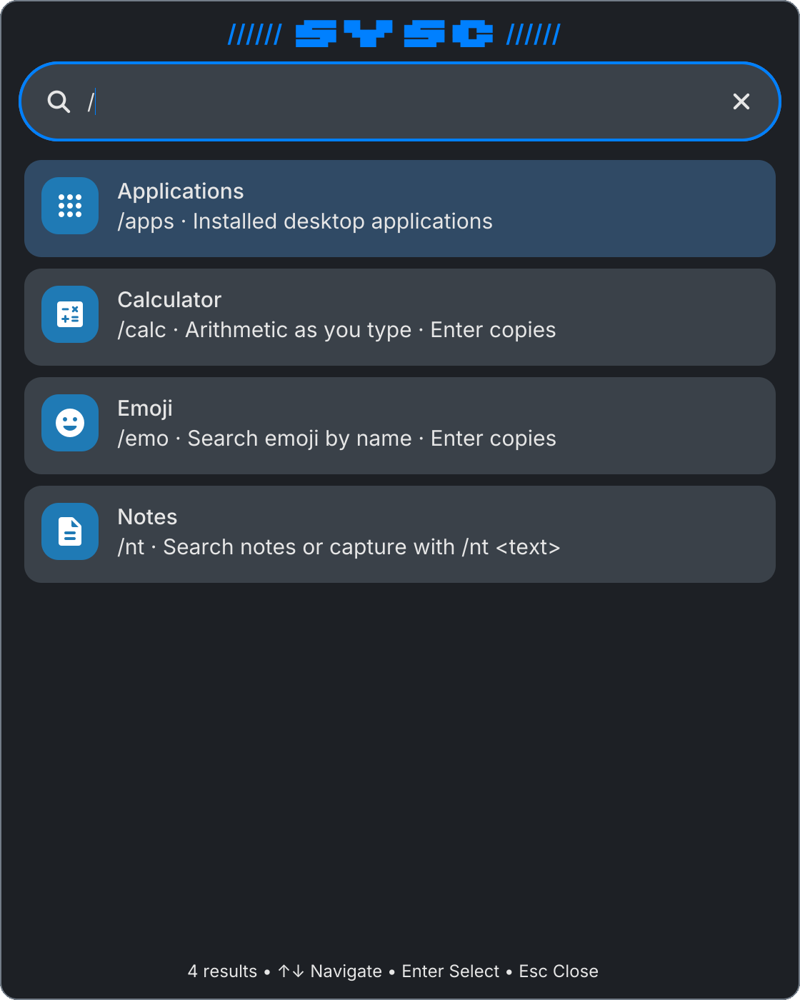

# Launcher Providers Implementation Plan

> **For agentic workers:** REQUIRED SUB-SKILL: Use superpowers:subagent-driven-development (recommended) or superpowers:executing-plans to implement this plan task-by-task. Steps use checkbox (`- [ ]`) syntax for tracking.

**Goal:** The launcher gains a calculator (`/calc`, and inline for real expressions), an emoji search (`/emo`), desktop actions as ranked rows, and a `/` overview listing four providers — all through a provider seam in sysc-launch, with Notes moved onto the same seam.

**Architecture:** sysc-launch v0.2.0 (a separate module) adds `ServiceConfig.Providers`, `Provider.Activate(query, id, action)`, `Provider.Inline`, `ServiceConfig.ApplicationsGlyph` and `Result.Action`. The shell supplies calculator, emoji and Notes providers as closures, ranks desktop actions in its injected `launcherRank`, and paints provider rows through an icon-slot convention (`glyph:` / `text:`). Calculator and emoji copy through the shell's own clipboard from text-input parity Phase 3.

**Tech Stack:** Go 1.26; `github.com/Nomadcxx/sysc-launch` (v0.1.0 → v0.2.0); pure new packages `internal/calc`, `internal/emoji`; `tools/emojigen`; Material Symbols subset build (`python3` + fontTools).

**Spec:** `docs/plans/2026-09-27-launcher-providers-design.md` (`sysc-624`), including its **Amendment 2026-09-27 — settled by the rendered mockups**. Read both before Task 1.

## What it will look like

These were rendered by the shell's own launcher panel and painter at 2× (560×700 logical), with the real theme, real installed apps and icons, and the two new glyphs built from the pinned Material font. They are the acceptance target for Task 9's live gate. Files: `docs/plans/assets/2026-09-27-launcher-providers/`.

| Scene | Image |
|---|---|
| Bare `6*7`: inline calculator row, footer "1 result" |  |
| `/calc sqrt(2)*10` |  |
| `/calc 2+`: muted hint row, footer "No results" |  |
| `/emo party`: emoji in the untinted slot, keywords below |  |
| `brave`: apps first, then their desktop actions |  |
| `private window`: actions across apps |  |
| `/`: overview of four providers |  |

Row text formats, exactly as rendered:

- Calculator: name `= <result>`, comment `<expression> · Enter copies`, icon `glyph:calculate`.
- Calculator hint: name `Invalid expression`, comment `Try 6*7 · sqrt(2) · 2^10 · sin(pi/2)`, empty ID.
- Emoji: name `<CLDR name>`, comment first three keywords joined by ` · `, icon `text:<emoji>`.
- Desktop action: name `<App> · <Action>`, comment `Desktop action`, the action's icon if it names one, else the app's.
- Overview: name = provider name, comment `<prefix> · <description>`, icons `glyph:apps`, `glyph:calculate`, `glyph:mood`, `glyph:description`.

## Global Constraints

- Build and test only from your own worktrees off `origin/main` — one for `sysc-shell`, one for `sysc-launch`. Never edit `/home/nomadx/sysc-shell` or `/home/nomadx/sysc-launch` in place: both hold other sessions' uncommitted work (`sysc-launch` has an uncommitted `score.go`/`score_test.go` change removing the result cap).
- Do not modify `sysc-launch`'s `score.go`, `apps.go` or `history.go` (spec Ownership).
- Cap repo-wide Go commands: `GOMAXPROCS=4 go test -p 2 ...`.
- Commit messages must not contain these substrings (a global hook rejects them): `bot` (so not "both", "bottom"), `agent`, `cursor`, `llm`, `codex`, `claude`. No attribution trailers.
- Tagging `sysc-launch` `v0.2.0` and pushing it is part of Task 1 (owner-approved in the design). Push the tag only after `main` carries the commit.
- **Task 8 waits for `sysc-623` Tasks 11–12** (text-input parity clipboard: `wayland.SelectionRequest`, `Registry.requestSelection`) to be on `sysc-shell` `origin/main`. Check with `git log origin/main --oneline -- internal/shell/selection.go`. Tasks 1–7 do not wait.
- Deploys follow the deploy rule (ancestor checks, rollback copy, report `vcs.revision`/`vcs.modified`, redeploy clean `origin/main` after testing a branch).

## Review Focus

1. **A bare query that is a number or a word.** `2048`, `e`, `pi`, `firefox` must never show a calculator row. Test: Task 4 `TestInlineRuleNegatives`.
2. **An inline calculator row activated under a bare query.** It must copy, not try to spawn an app with id `calc:42`. Test: Task 1 `TestInlineRowActivatesThroughItsProvider`.
3. **Activating a row from a result set that was just superseded** (Enter pressed as a new query publishes). Expect the old row's provider to be found only if the row is still in the published set; otherwise the Applications spawn path's "no entry" error, never a panic. Test: Task 1 `TestActivateUnknownRowFallsBackToSpawnPath`.
4. **Emoji table integrity after regeneration.** No skin-tone modifiers, no duplicates, every row valid UTF-8, the count within the expected band. Test: Task 5 `TestEmojiTableIntegrity`.
5. **Notes capture still works end to end after the migration**, including the too-long capture. Test: Task 7 keeps every existing Notes launcher test green, plus `TestNotesIsAProvider`.

---

## Part A — sysc-launch v0.2.0

### Task 1: The provider seam

**Repository:** `github.com/Nomadcxx/sysc-launch`, worktree off its `origin/main`.

**Files:**
- Modify: `prefix.go` (`Provider` fields; `buildRegistry`)
- Modify: `entry.go` (`Result.Action`)
- Modify: `service.go` (`ServiceConfig.Providers`, `ServiceConfig.ApplicationsGlyph`; inline merge; row ownership; activation routing)
- Test: `provider_test.go` (new)

**Interfaces:**
- Produces:

```go
type Provider struct {
	Name, Prefix, Glyph, Description string
	Query    func(query string) []Result
	Activate func(query, id, action string) error // nil: spawn the entry or its action
	Inline   bool                                   // also queried for bare text; rows go first
}
type Result struct {
	Entry  Entry
	Score  int
	Action string
}
// ServiceConfig gains:
Providers         []Provider
ApplicationsGlyph string // overview glyph for Applications; "" = PlaceholderGlyph
func buildRegistry(apps Provider, extra []Provider, logf func(string, ...any)) []Provider
```

- [ ] **Step 1: Write the failing tests** (`provider_test.go`)

```go
package launcher

import (
	"context"
	"errors"
	"strings"
	"sync"
	"testing"
)

func extraProviders(activated *[]string, mu *sync.Mutex) []Provider {
	record := func(tag string) func(q, id, a string) error {
		return func(q, id, a string) error {
			mu.Lock()
			defer mu.Unlock()
			*activated = append(*activated, tag+":"+q+":"+id+":"+a)
			return nil
		}
	}
	return []Provider{
		{Name: "Calculator", Prefix: "/calc", Glyph: "glyph:calculate", Description: "Arithmetic", Inline: true,
			Query: func(q string) []Result {
				if strings.Contains(q, "*") {
					return []Result{{Entry: Entry{ID: "calc:42", Name: "= 42"}}}
				}
				return nil
			},
			Activate: record("calc")},
		{Name: "Emoji", Prefix: "/emo", Glyph: "glyph:mood", Description: "Emoji",
			Query:    func(q string) []Result { return []Result{{Entry: Entry{ID: "🎉", Name: "party popper"}}} },
			Activate: record("emo")},
		{Name: "Dup", Prefix: "/emo", Query: func(string) []Result { return nil }},
		{Name: "NoSlash", Prefix: "x", Query: func(string) []Result { return nil }},
		{Name: "Apps again", Prefix: "/apps", Query: func(string) []Result { return nil }},
	}
}

func newProviderService(t *testing.T, activated *[]string, mu *sync.Mutex, spawned *[][]string) *Service {
	t.Helper()
	svc := NewService(ServiceConfig{
		Scan: func() []Entry {
			return []Entry{{ID: "alpha.desktop", Name: "Alpha", Argv: []string{"alpha"},
				Actions: []Action{{ID: "new", Name: "New", Argv: []string{"alpha", "--new"}}}}}
		},
		Providers:         extraProviders(activated, mu),
		ApplicationsGlyph: "glyph:apps",
		Run: func(_ context.Context, argv []string) error {
			mu.Lock()
			defer mu.Unlock()
			*spawned = append(*spawned, argv)
			return nil
		},
		Logf: func(string, ...any) {},
	})
	t.Cleanup(svc.Close)
	recvResults(t, svc)
	return svc
}

func TestOverviewListsValidProvidersInOrder(t *testing.T) {
	var mu sync.Mutex
	var activated []string
	var spawned [][]string
	svc := newProviderService(t, &activated, &mu, &spawned)
	svc.Query("/")
	got := recvResults(t, svc)
	var names []string
	for _, r := range got {
		names = append(names, r.Entry.Name+"|"+r.Entry.IconName)
	}
	want := []string{"Applications|glyph:apps", "Calculator|glyph:calculate", "Emoji|glyph:mood"}
	if strings.Join(names, ",") != strings.Join(want, ",") {
		t.Fatalf("overview %v, want %v (duplicate, slashless and /apps providers skipped)", names, want)
	}
}

// Review focus 2.
func TestInlineRowActivatesThroughItsProvider(t *testing.T) {
	var mu sync.Mutex
	var activated []string
	var spawned [][]string
	svc := newProviderService(t, &activated, &mu, &spawned)
	svc.Query("6*7")
	got := recvResults(t, svc)
	if len(got) == 0 || got[0].Entry.ID != "calc:42" {
		t.Fatalf("inline row not first: %+v", got)
	}
	if err := svc.Activate("calc:42", ""); err != nil {
		t.Fatal(err)
	}
	mu.Lock()
	defer mu.Unlock()
	if len(activated) != 1 || activated[0] != "calc:6*7:calc:42:" || len(spawned) != 0 {
		t.Fatalf("activated %v spawned %v", activated, spawned)
	}
}

func TestPrefixedProviderGetsTheStrippedQuery(t *testing.T) {
	var mu sync.Mutex
	var activated []string
	var spawned [][]string
	svc := newProviderService(t, &activated, &mu, &spawned)
	svc.Query("/emo party")
	recvResults(t, svc)
	if err := svc.Activate("🎉", ""); err != nil {
		t.Fatal(err)
	}
	mu.Lock()
	defer mu.Unlock()
	if len(activated) != 1 || activated[0] != "emo:party:🎉:" {
		t.Fatalf("activated %v", activated)
	}
}

func TestApplicationRowsAndActionsStillSpawn(t *testing.T) {
	var mu sync.Mutex
	var activated []string
	var spawned [][]string
	svc := newProviderService(t, &activated, &mu, &spawned)
	svc.Query("alpha")
	recvResults(t, svc)
	if err := svc.Activate("alpha.desktop", "new"); err != nil {
		t.Fatal(err)
	}
	mu.Lock()
	defer mu.Unlock()
	if len(spawned) != 1 || spawned[0][len(spawned[0])-1] != "--new" {
		t.Fatalf("spawned %v", spawned)
	}
}

// Review focus 3.
func TestActivateUnknownRowFallsBackToSpawnPath(t *testing.T) {
	var mu sync.Mutex
	var activated []string
	var spawned [][]string
	svc := newProviderService(t, &activated, &mu, &spawned)
	svc.Query("alpha")
	recvResults(t, svc)
	err := svc.Activate("calc:42", "")
	if err == nil || !strings.Contains(err.Error(), "no entry") {
		t.Fatalf("stale provider row: err = %v", err)
	}
	if errors.Is(err, ErrServiceClosed) {
		t.Fatal("wrong error")
	}
}

func TestResultActionSurvivesThePublish(t *testing.T) {
	svc := NewService(ServiceConfig{
		Scan: func() []Entry { return []Entry{{ID: "a", Name: "A"}} },
		Rank: func(es []Entry, q string, _ func(string, string) int) []Result {
			return []Result{{Entry: es[0], Action: "new"}}
		},
	})
	t.Cleanup(svc.Close)
	recvResults(t, svc)
	svc.Query("a")
	if got := recvResults(t, svc); len(got) != 1 || got[0].Action != "new" {
		t.Fatalf("got %+v", got)
	}
}
```

- [ ] **Step 2: Run to verify they fail**

Run: `GOWORK=off go test ./... -run 'Overview|Inline|Stripped|StillSpawn|UnknownRow|ActionSurvives' -count=1`
Expected: FAIL — unknown fields `Providers`, `Activate`, `Inline`, `Action`, `ApplicationsGlyph`.

- [ ] **Step 3: Implement**

`entry.go`: add `Action string` to `Result` with the comment `// Action is a desktop action ID when this row is one of Entry's actions.`

`prefix.go`: add `Activate` and `Inline` to `Provider` (documented as in **Interfaces**), give `applicationsProvider` a `glyph string` parameter (empty → `PlaceholderGlyph`), and add:

```go
// buildRegistry puts Applications first and appends the configured providers
// that have a unique "/" prefix and a query function. A rejected provider is
// logged and skipped, never fatal.
func buildRegistry(apps Provider, extra []Provider, logf func(string, ...any)) []Provider {
	registry := []Provider{apps}
	seen := map[string]bool{apps.Prefix: true}
	for _, p := range extra {
		switch {
		case p.Query == nil:
			logf("launcher: provider %q has no query function; skipped", p.Name)
		case !strings.HasPrefix(p.Prefix, "/") || len(p.Prefix) < 2:
			logf("launcher: provider %q prefix %q must start with /; skipped", p.Name, p.Prefix)
		case seen[p.Prefix]:
			logf("launcher: provider %q prefix %q is taken; skipped", p.Name, p.Prefix)
		default:
			seen[p.Prefix] = true
			registry = append(registry, p)
		}
	}
	return registry
}
```

`service.go`: add `Providers []Provider` and `ApplicationsGlyph string` to `ServiceConfig`. In `NewService`, default `cfg.Logf` to a no-op when nil. In `work`:

```go
	registry := buildRegistry(applicationsProvider(func(query string) []Result {
		return s.cfg.Rank(entries, query, boost)
	}, s.cfg.ApplicationsGlyph), s.cfg.Providers, s.cfg.Logf)

	type rowKey struct{ id, action string }
	owners := map[rowKey]int{} // rows of the last published set → registry index

	run := func(text string) ([]Result, map[rowKey]int) {
		own := map[rowKey]int{}
		r := route(registry, text)
		if r.provider == nil {
			return r.overview, own
		}
		var out []Result
		if r.provider == &registry[0] && strings.TrimSpace(text) != "" && !strings.HasPrefix(strings.TrimSpace(text), "/") {
			for i := 1; i < len(registry); i++ {
				if !registry[i].Inline {
					continue
				}
				for _, res := range registry[i].Query(r.query) {
					own[rowKey{res.Entry.ID, res.Action}] = i
					out = append(out, res)
				}
			}
		}
		idx := 0
		for i := range registry {
			if &registry[i] == r.provider {
				idx = i
			}
		}
		for _, res := range r.provider.Query(r.query) {
			k := rowKey{res.Entry.ID, res.Action}
			if _, taken := own[k]; !taken {
				own[k] = idx
			}
			out = append(out, res)
		}
		return out, own
	}
```

Every place that published `run(...)` now does `out, own := run(...)`, and when it publishes `out` it also sets `owners = own`. The activation case becomes:

```go
		case req := <-s.activateCh:
			recordQuery := lastQuery
			if r := route(registry, lastQuery); r.provider != nil {
				recordQuery = r.query
			}
			if i, ok := owners[rowKey{req.id, req.action}]; ok && registry[i].Activate != nil {
				err := registry[i].Activate(recordQuery, req.id, req.action)
				if err == nil && s.cfg.History != nil {
					s.cfg.History.record(recordQuery, req.id)
				}
				req.reply <- err
				continue
			}
			req.reply <- s.activate(entries, recordQuery, req.id, req.action)
```

Document on `ServiceConfig.Providers` that provider functions run on the service goroutine and may block activation, so they must not call back into the `Service`.

- [ ] **Step 4: Run the module's tests**

Run: `GOMAXPROCS=4 GOWORK=off go test -p 2 -race -count=1 ./...`
Expected: PASS, including `cmd/sysc-launch` (it passes no providers and must behave as before).

- [ ] **Step 5: Document, commit, tag**

Add a "Providers" section to `README.md`: the fields, the inline rule, that provider functions run on the service goroutine, and that rows are owned by the provider that produced them in the last published set.

```bash
git add prefix.go entry.go service.go provider_test.go README.md
git commit -m "feat: provider seam - appended providers, per-provider activation, inline rows, result actions"
git fetch origin && git merge-base --is-ancestor origin/main HEAD && git push origin HEAD:main
git tag -a v0.2.0 -m "sysc-launch v0.2.0: provider seam" && git push origin v0.2.0
```

If `origin/main` moved (the uncommitted `score.go` change may have landed), rebase, rerun Step 4, then push and tag.

---

## Part B — sysc-shell

### Task 2: Bump sysc-launch and add the two glyphs

**Files:**
- Modify: `go.mod`, `go.sum`
- Modify: `internal/render/icons/material/build.py` (`ICONS` gains `"calculate"`, `"mood"`), `internal/render/icons/material/material-symbols-rounded.ttf` (rebuilt), `internal/render/materialfont.go` (inventory map), `internal/render/materialfont_test.go` (expected names)
- Modify: `internal/shell/launcher_rank.go` if the bump breaks its build (it must return `[]launcher.Result`, unchanged)

- [ ] **Step 1: Bump**

Run: `GOWORK=off go get github.com/Nomadcxx/sysc-launch@v0.2.0 && GOWORK=off go build ./...`

- [ ] **Step 2: Build the subset**

```bash
curl -sSL -o /tmp/msr.ttf 'https://raw.githubusercontent.com/google/material-design-icons/84ccef280841abfac506afc4ad4a2782f6d0a1d0/variablefont/MaterialSymbolsRounded%5BFILL%2CGRAD%2Copsz%2Cwght%5D.ttf'
sha256sum /tmp/msr.ttf   # must be c4416e02739ed6865e3218c19dcd62c5a88fb97b8bcc445f24ae8017d11cc2d0
```

Add `"calculate",` and `"mood",` to `ICONS` in `build.py`; add `"calculate": {}, "mood": {},` to the inventory map in `materialfont.go`; add both names to the expected list in `materialfont_test.go` (the test that pins the inventory, `TestMaterialInventoryMatchesTheSubset`). Then:

```bash
python3 internal/render/icons/material/build.py /tmp/msr.ttf
```

Do **not** add `emoji_emotions`: it is not in Material Symbols (spec amendment 1).

- [ ] **Step 3: Run**

Run: `GOMAXPROCS=4 GOWORK=off go test -p 2 -count=1 ./internal/render ./internal/shell`
Expected: PASS apart from failures that also fail on a clean `origin/main` (on 2026-09-27: `TestPanelSectionValidationPrecedesMutation` and three battery-widget tests).

- [ ] **Step 4: Commit**

```bash
git add go.mod go.sum internal/render
git commit -m "build: sysc-launch v0.2.0; calculate and mood glyphs in the Material subset"
```

### Task 3: Provider rows paint as in the mockups

**Files:**
- Modify: `internal/shell/popout_launcher.go` (`launcherIconNode`, `launcherRow`, `launcherRowBody`, `launcherFooter`, `launcherActivateSelected`)
- Test: `internal/shell/popout_launcher_test.go`

**Interfaces:**
- Produces: the `glyph:` / `text:` icon-slot convention; hint rows (`Entry.ID == ""`); corrected footer.

- [ ] **Step 1: Write the failing tests**

```go
func TestLauncherIconSlotConventions(t *testing.T) {
	r := newPanelRegistry(t)
	h := &PanelHost{}
	g := launcherIconNode(r, h, launcher.Entry{Name: "Calculator", IconName: "glyph:calculate"})
	if g.Fill != ui.FillContainer || len(g.Children) != 1 || g.Children[0].Kind != ui.KindIcon || g.Children[0].Icon != "calculate" {
		t.Fatalf("glyph slot %+v", g)
	}
	e := launcherIconNode(r, h, launcher.Entry{Name: "party popper", IconName: "text:🎉"})
	if e.Fill != ui.FillNone || e.Children[0].Text != "🎉" || e.Children[0].TextRole != theme.RoleDisplay {
		t.Fatalf("text slot %+v", e)
	}
}

func TestLauncherHintRowIsMutedUnselectedAndUncounted(t *testing.T) {
	r := newPanelRegistry(t)
	h := &PanelHost{query: "/calc 2+", launcherResults: []launcher.Result{
		{Entry: launcher.Entry{Name: "Invalid expression", Comment: "Try 6*7", IconName: "glyph:calculate"}},
	}}
	row := launcherRow(r, h, h.launcherResults, 0)
	capsule := row.Children[0]
	if capsule.Fill != ui.FillNone {
		t.Fatal("hint row highlighted")
	}
	if !treeHasText(launcherFooter(h, 1), "No results") {
		t.Fatal("footer counted the hint")
	}
}

func TestLauncherFooterPluralises(t *testing.T) {
	one := &PanelHost{query: "6*7", launcherResults: []launcher.Result{{Entry: launcher.Entry{ID: "calc:42"}}}}
	if !treeHasText(launcherFooter(one, 1), "1 result •") {
		t.Fatal("singular")
	}
	browse := &PanelHost{launcherResults: make([]launcher.Result, 3)}
	for i := range browse.launcherResults {
		browse.launcherResults[i].Entry.ID = fmt.Sprintf("app%d", i)
	}
	if !treeHasText(launcherFooter(browse, 3), "3 apps") {
		t.Fatal("plural browse")
	}
}
```

(`treeHasText` exists in `internal/shell` tests; if its match is exact-text rather than substring, compare against the full footer string built with `launcherHints`.)

- [ ] **Step 2: Run to verify they fail**

Run: `GOWORK=off go test ./internal/shell -run 'IconSlotConventions|HintRow|FooterPluralises' -count=1`
Expected: FAIL.

- [ ] **Step 3: Implement** (this is the exact code the mockups were rendered with)

At the top of `launcherIconNode`:

```go
	// Provider rows have no desktop icon. "glyph:<name>" draws a Material
	// subset glyph in the slot; "text:<s>" draws s itself (an emoji).
	if name, ok := strings.CutPrefix(e.IconName, "glyph:"); ok {
		return &ui.Node{
			Kind: ui.KindCapsule, Width: launcherIconSlot, Height: launcherIconSlot,
			Fill: ui.FillContainer, Shape: ui.ShapeMedium,
			Children: []*ui.Node{{Kind: ui.KindIcon, Icon: name, IconSize: 24}},
		}
	}
	if text, ok := strings.CutPrefix(e.IconName, "text:"); ok {
		return &ui.Node{
			Kind: ui.KindCapsule, Width: launcherIconSlot, Height: launcherIconSlot,
			Fill: ui.FillNone, Shape: ui.ShapeMedium,
			Children: []*ui.Node{{Kind: ui.KindText, Text: text, TextRole: theme.RoleDisplay}},
		}
	}
```

In `launcherRow`, highlight only real rows: `if i == h.launcherSel && res.Entry.ID != "" { fill = ui.FillSoft }`.

In `launcherRowBody`, mute hints:

```go
	tone := ui.ToneNormal
	if e.ID == "" {
		tone = ui.ToneSubtle // a hint, not a result
	}
	labels := []*ui.Node{{Kind: ui.KindText, Text: e.Name, TextRole: theme.RoleLabel, Tone: tone}}
	if e.Comment != "" {
		labels = append(labels, &ui.Node{Kind: ui.KindText, Text: e.Comment, Tone: tone})
	}
```

Replace `launcherFooter`:

```go
func launcherFooter(h *PanelHost, count int) *ui.Node {
	// Hint rows (empty ID) explain; they are not results.
	for _, res := range h.launcherResults {
		if res.Entry.ID == "" {
			count--
		}
	}
	noun := "result"
	if strings.TrimSpace(h.query) == "" {
		noun = "app"
	}
	if count != 1 {
		noun += "s"
	}
	text := fmt.Sprintf("%d %s • %s", count, noun, launcherHints)
	if count == 0 {
		text = "No results • " + launcherHints
	}
	return &ui.Node{Kind: ui.KindText, CenterX: true, TextRole: theme.RoleCaption, Text: text}
}
```

In `launcherActivateSelected`, after clamping `launcherSel`, return early when `res.Entry.ID == ""`.

- [ ] **Step 4: Run and commit**

Run: `GOWORK=off go test ./internal/shell -run Launcher -count=1` — PASS.

```bash
git add internal/shell/popout_launcher.go internal/shell/popout_launcher_test.go
git commit -m "feat(launcher): glyph and text icon slots, muted hint rows, counted footer"
```

### Task 4: The calculator package

**Files:**
- Create: `internal/calc/calc.go`, `internal/calc/calc_test.go`

**Interfaces:**
- Produces:

```go
func Eval(expr string) (float64, error)
func Format(v float64) string        // %.12g, trailing zeros trimmed, -0 as 0
func IsExpression(s string) bool     // parses fully AND has an operator or a function call
var ErrSyntax = errors.New("calc: invalid expression")
```

- [ ] **Step 1: Write the failing tests**

```go
package calc

import (
	"math"
	"testing"
)

func TestEval(t *testing.T) {
	cases := []struct {
		in   string
		want float64
	}{
		{"6*7", 42}, {"1+2*3", 7}, {"(1+2)*3", 9}, {"2^3^2", 512}, {"-2^2", -4}, {"10%4", 2},
		{"7/2", 3.5}, {"1e3+1", 1001}, {"sqrt(16)", 4}, {"abs(-3)", 3}, {"ln(e)", 1}, {"log(1000)", 3},
		{"sin(pi/2)", 1}, {"cos(0)", 1}, {"tan(0)", 0}, {"floor(2.7)", 2}, {"ceil(2.1)", 3}, {"round(2.5)", 3},
		{"6×7", 42}, {"84÷2", 42}, {"  SQRT( 16 ) ", 4}, {"2(3)", math.NaN()},
	}
	for _, tc := range cases {
		got, err := Eval(tc.in)
		if math.IsNaN(tc.want) {
			if err == nil {
				t.Errorf("%q: want an error, got %v", tc.in, got)
			}
			continue
		}
		if err != nil || math.Abs(got-tc.want) > 1e-9 {
			t.Errorf("%q = %v, %v; want %v", tc.in, got, err, tc.want)
		}
	}
}

func TestEvalErrors(t *testing.T) {
	for _, in := range []string{"", "2+", "(1", "1)", "foo(2)", "1/0", "sqrt(-1)", "2**3", "1,5"} {
		if _, err := Eval(in); err == nil {
			t.Errorf("%q: want an error", in)
		}
	}
}

func TestFormat(t *testing.T) {
	cases := map[float64]string{42: "42", 3.5: "3.5", 14.142135623730951: "14.1421356237", -0.0: "0", 1e21: "1e+21", 0.1 + 0.2: "0.3"}
	for v, want := range cases {
		if got := Format(v); got != want {
			t.Errorf("Format(%v) = %q, want %q", v, got, want)
		}
	}
}

// Review focus 1.
func TestInlineRuleNegatives(t *testing.T) {
	for _, s := range []string{"2048", "e", "pi", "firefox", "-3", "(2)", "", "6*"} {
		if IsExpression(s) {
			t.Errorf("%q counted as an expression", s)
		}
	}
	for _, s := range []string{"6*7", "sqrt(2)", "2^10", "1-1", "abs(3)"} {
		if !IsExpression(s) {
			t.Errorf("%q not counted as an expression", s)
		}
	}
}
```

(`1/0` and `sqrt(-1)` are errors because infinities and NaN are not results. `-3` and `(2)` are not inline expressions: unary minus and parentheses alone are not operators for the inline rule.)

- [ ] **Step 2: Run to verify they fail**

Run: `GOWORK=off go test ./internal/calc -count=1` — FAIL, package missing.

- [ ] **Step 3: Implement `internal/calc/calc.go`**

```go
// Package calc evaluates the launcher's arithmetic: a recursive-descent
// parser over float64 with a fixed grammar and no variables.
package calc

import (
	"errors"
	"math"
	"strconv"
	"strings"
	"unicode"
)

var ErrSyntax = errors.New("calc: invalid expression")

type parser struct {
	s        string
	pos      int
	operator bool // saw a binary operator or a function call
}

func normalise(s string) string {
	s = strings.ToLower(strings.TrimSpace(s))
	s = strings.NewReplacer("×", "*", "÷", "/").Replace(s)
	return strings.Join(strings.Fields(s), "")
}

func parse(expr string) (float64, bool, error) {
	p := &parser{s: normalise(expr)}
	if p.s == "" {
		return 0, false, ErrSyntax
	}
	v, err := p.sum()
	if err != nil {
		return 0, false, err
	}
	if p.pos != len(p.s) {
		return 0, false, ErrSyntax
	}
	if math.IsNaN(v) || math.IsInf(v, 0) {
		return 0, false, ErrSyntax
	}
	return v, p.operator, nil
}

func Eval(expr string) (float64, error) { v, _, err := parse(expr); return v, err }

func IsExpression(s string) bool { _, op, err := parse(s); return err == nil && op }

func Format(v float64) string {
	if v == 0 {
		return "0"
	}
	return strconv.FormatFloat(v, 'g', 12, 64)
}

func (p *parser) peek() byte {
	if p.pos < len(p.s) {
		return p.s[p.pos]
	}
	return 0
}

// sum := product (('+'|'-') product)*
func (p *parser) sum() (float64, error) {
	v, err := p.product()
	for err == nil && (p.peek() == '+' || p.peek() == '-') {
		op := p.peek()
		p.pos++
		p.operator = true
		var r float64
		if r, err = p.product(); err == nil {
			if op == '+' {
				v += r
			} else {
				v -= r
			}
		}
	}
	return v, err
}

// product := unary (('*'|'/'|'%') unary)*
func (p *parser) product() (float64, error) {
	v, err := p.unary()
	for err == nil && (p.peek() == '*' || p.peek() == '/' || p.peek() == '%') {
		op := p.peek()
		p.pos++
		if p.peek() == '*' {
			return 0, ErrSyntax // "**" is not an operator here
		}
		p.operator = true
		var r float64
		if r, err = p.unary(); err == nil {
			switch op {
			case '*':
				v *= r
			case '/':
				v /= r
			case '%':
				v = math.Mod(v, r)
			}
		}
	}
	return v, err
}

// unary := '-' unary | power   (so -2^2 is -(2^2))
func (p *parser) unary() (float64, error) {
	if p.peek() == '-' {
		p.pos++
		v, err := p.unary()
		return -v, err
	}
	return p.power()
}

// power := atom ('^' unary)?   right-associative
func (p *parser) power() (float64, error) {
	v, err := p.atom()
	if err == nil && p.peek() == '^' {
		p.pos++
		p.operator = true
		var r float64
		if r, err = p.unary(); err == nil {
			v = math.Pow(v, r)
		}
	}
	return v, err
}

var functions = map[string]func(float64) float64{
	"sqrt": math.Sqrt, "abs": math.Abs, "ln": math.Log, "log": math.Log10,
	"sin": math.Sin, "cos": math.Cos, "tan": math.Tan,
	"floor": math.Floor, "ceil": math.Ceil, "round": math.Round,
}

// atom := number | constant | function '(' sum ')' | '(' sum ')'
func (p *parser) atom() (float64, error) {
	switch c := p.peek(); {
	case c == '(':
		p.pos++
		v, err := p.sum()
		if err != nil || p.peek() != ')' {
			return 0, ErrSyntax
		}
		p.pos++
		return v, nil
	case c >= '0' && c <= '9' || c == '.':
		start := p.pos
		for p.pos < len(p.s) && (p.s[p.pos] >= '0' && p.s[p.pos] <= '9' || p.s[p.pos] == '.') {
			p.pos++
		}
		if p.pos < len(p.s) && p.s[p.pos] == 'e' && p.pos+1 < len(p.s) &&
			(unicode.IsDigit(rune(p.s[p.pos+1])) || p.s[p.pos+1] == '-' || p.s[p.pos+1] == '+') {
			p.pos += 2
			for p.pos < len(p.s) && p.s[p.pos] >= '0' && p.s[p.pos] <= '9' {
				p.pos++
			}
		}
		v, err := strconv.ParseFloat(p.s[start:p.pos], 64)
		if err != nil {
			return 0, ErrSyntax
		}
		if p.peek() == '(' {
			return 0, ErrSyntax // no implicit multiplication
		}
		return v, nil
	case c >= 'a' && c <= 'z':
		start := p.pos
		for p.pos < len(p.s) && p.s[p.pos] >= 'a' && p.s[p.pos] <= 'z' {
			p.pos++
		}
		name := p.s[start:p.pos]
		if fn, ok := functions[name]; ok && p.peek() == '(' {
			p.pos++
			p.operator = true
			v, err := p.sum()
			if err != nil || p.peek() != ')' {
				return 0, ErrSyntax
			}
			p.pos++
			return fn(v), nil
		}
		switch name {
		case "pi":
			return math.Pi, nil
		case "e":
			return math.E, nil
		}
	}
	return 0, ErrSyntax
}
```

`round(2.5)` is 3 with `math.Round` (half away from zero). `1,5` fails because `,` is never consumed.

- [ ] **Step 4: Run and commit**

Run: `GOWORK=off go test ./internal/calc -count=1 -race` — PASS.

```bash
git add internal/calc
git commit -m "feat(calc): the launcher's arithmetic evaluator"
```

### Task 5: The emoji table and search

**Files:**
- Create: `tools/emojigen/main.go`, `internal/emoji/emoji.go`, `internal/emoji/emoji_test.go`, `internal/emoji/emoji.tsv` (generated, committed), `internal/emoji/LICENSE`, `internal/emoji/SOURCE.md`

**Interfaces:**
- Produces:

```go
type Emoji struct {
	Char     string
	Name     string
	Keywords []string
}
func All() []Emoji                  // table order
func Search(query string, limit int) []Emoji
```

TSV format, one emoji per line, tab-separated: `<emoji>\t<name>\t<keyword>|<keyword>|...`.

- [ ] **Step 1: Write the generator** (`tools/emojigen/main.go`)

Sources: Unicode 16.0 `emoji-test.txt` and CLDR release 46 English annotations (base and derived). Rules: keep `fully-qualified` lines; skip the `Component` group and any sequence containing a skin-tone modifier (U+1F3FB–U+1F3FF); the name is the comment text after the `E<version>` token; keywords are the CLDR non-`tts` annotation for the exact sequence (base file first, then derived), split on `|`, trimmed, with the name removed; rows keep file order.

```go
// Command emojigen regenerates internal/emoji/emoji.tsv from pinned Unicode
// and CLDR data. It is an authoring tool, never run by go build.
package main

import (
	"bufio"
	"bytes"
	"crypto/sha256"
	"encoding/hex"
	"encoding/xml"
	"flag"
	"fmt"
	"io"
	"log"
	"net/http"
	"os"
	"strings"
)

const (
	testURL    = "https://www.unicode.org/Public/emoji/16.0/emoji-test.txt"
	annURL     = "https://raw.githubusercontent.com/unicode-org/cldr/release-46/common/annotations/en.xml"
	derivedURL = "https://raw.githubusercontent.com/unicode-org/cldr/release-46/common/annotationsDerived/en.xml"
)

type ldml struct {
	Annotations []struct {
		CP    string `xml:"cp,attr"`
		Type  string `xml:"type,attr"`
		Value string `xml:",chardata"`
	} `xml:"annotations>annotation"`
}

func fetch(url, wantSHA string) []byte {
	resp, err := http.Get(url)
	if err != nil {
		log.Fatal(err)
	}
	defer resp.Body.Close()
	if resp.StatusCode != http.StatusOK {
		log.Fatalf("%s: %s", url, resp.Status)
	}
	b, err := io.ReadAll(resp.Body)
	if err != nil {
		log.Fatal(err)
	}
	sum := sha256.Sum256(b)
	got := hex.EncodeToString(sum[:])
	fmt.Fprintf(os.Stderr, "%s  %s\n", got, url)
	if wantSHA != "" && got != wantSHA {
		log.Fatalf("%s: sha256 %s, want %s", url, got, wantSHA)
	}
	return b
}

func keywords(b []byte, into map[string][]string) {
	var doc ldml
	if err := xml.Unmarshal(b, &doc); err != nil {
		log.Fatal(err)
	}
	for _, a := range doc.Annotations {
		if a.Type == "tts" {
			continue
		}
		if _, seen := into[a.CP]; seen {
			continue
		}
		var kw []string
		for _, k := range strings.Split(a.Value, "|") {
			if k = strings.TrimSpace(k); k != "" {
				kw = append(kw, k)
			}
		}
		into[a.CP] = kw
	}
}

func skinToned(s string) bool {
	for _, r := range s {
		if r >= 0x1F3FB && r <= 0x1F3FF {
			return true
		}
	}
	return false
}

func main() {
	out := flag.String("out", "internal/emoji/emoji.tsv", "output TSV")
	testSHA := flag.String("sha-test", "", "expected sha256 of emoji-test.txt")
	annSHA := flag.String("sha-ann", "", "expected sha256 of annotations/en.xml")
	derivedSHA := flag.String("sha-derived", "", "expected sha256 of annotationsDerived/en.xml")
	flag.Parse()

	kw := map[string][]string{}
	keywords(fetch(annURL, *annSHA), kw)
	keywords(fetch(derivedURL, *derivedSHA), kw)

	var buf bytes.Buffer
	group, rows := "", 0
	sc := bufio.NewScanner(bytes.NewReader(fetch(testURL, *testSHA)))
	for sc.Scan() {
		line := sc.Text()
		if g, ok := strings.CutPrefix(line, "# group: "); ok {
			group = g
			continue
		}
		if line == "" || strings.HasPrefix(line, "#") || group == "Component" {
			continue
		}
		fields, comment, ok := strings.Cut(line, "#")
		if !ok || !strings.Contains(fields, "; fully-qualified") {
			continue
		}
		// comment: " 😀 E1.0 grinning face"
		parts := strings.Fields(comment)
		if len(parts) < 3 || !strings.HasPrefix(parts[1], "E") {
			continue
		}
		char, name := parts[0], strings.Join(parts[2:], " ")
		if skinToned(char) {
			continue
		}
		var keep []string
		for _, k := range kw[char] {
			if !strings.EqualFold(k, name) {
				keep = append(keep, k)
			}
		}
		fmt.Fprintf(&buf, "%s\t%s\t%s\n", char, name, strings.Join(keep, "|"))
		rows++
	}
	if err := sc.Err(); err != nil {
		log.Fatal(err)
	}
	if err := os.WriteFile(*out, buf.Bytes(), 0o644); err != nil {
		log.Fatal(err)
	}
	fmt.Fprintf(os.Stderr, "%d rows -> %s\n", rows, *out)
}
```

- [ ] **Step 2: Generate and record provenance**

```bash
GOWORK=off go run ./tools/emojigen -out internal/emoji/emoji.tsv
```

Record the three URLs, their SHA-256 sums (printed on stderr), the row count, and the date in `internal/emoji/SOURCE.md`, in the same table form as `internal/render/icons/material/SOURCE.md`, including the exact regeneration command with `-sha-test`, `-sha-ann` and `-sha-derived`. Copy the Unicode License v3 text (`https://www.unicode.org/license.txt`) to `internal/emoji/LICENSE`. Re-run with the recorded `-sha-*` flags and confirm the output is byte-identical (`git diff --exit-code internal/emoji/emoji.tsv`).

- [ ] **Step 3: Write the failing package tests**

```go
package emoji

import (
	"strings"
	"testing"
	"unicode/utf8"
)

// Review focus 4.
func TestEmojiTableIntegrity(t *testing.T) {
	all := All()
	if len(all) < 1500 || len(all) > 4000 {
		t.Fatalf("table has %d rows; Unicode 16 without skin tones is ~1,900", len(all))
	}
	seen := map[string]bool{}
	for _, e := range all {
		if !utf8.ValidString(e.Char) || e.Char == "" || e.Name == "" {
			t.Fatalf("bad row %+v", e)
		}
		for _, r := range e.Char {
			if r >= 0x1F3FB && r <= 0x1F3FF {
				t.Fatalf("skin-tone modifier in %q", e.Name)
			}
		}
		if seen[e.Char] {
			t.Fatalf("duplicate %q", e.Char)
		}
		seen[e.Char] = true
	}
}

func TestSearchRanksNameBeforeKeyword(t *testing.T) {
	got := Search("party", 5)
	if len(got) == 0 || got[0].Name != "party popper" {
		t.Fatalf("first result %+v, want party popper (name prefix beats keyword)", got)
	}
	names := make([]string, len(got))
	for i, e := range got {
		names[i] = e.Name
	}
	if !contains(names, "partying face") {
		t.Fatalf("partying face missing from %v", names)
	}
}

func TestSearchExactNameFirstAndCap(t *testing.T) {
	if got := Search("fire", 50); len(got) == 0 || got[0].Name != "fire" {
		t.Fatalf("exact name not first: %+v", got[:min(3, len(got))])
	}
	if got := Search("a", 50); len(got) != 50 {
		t.Fatalf("cap: %d", len(got))
	}
	if got := Search("", 50); len(got) != 50 || got[0].Char != All()[0].Char {
		t.Fatal("empty query lists the table head")
	}
	if got := Search("PARTY", 5); len(got) == 0 || got[0].Name != "party popper" {
		t.Fatal("case-insensitive")
	}
}

func contains(xs []string, s string) bool {
	for _, x := range xs {
		if strings.EqualFold(x, s) {
			return true
		}
	}
	return false
}
```

- [ ] **Step 4: Implement `internal/emoji/emoji.go`**

```go
// Package emoji is the launcher's embedded emoji table and search.
package emoji

import (
	_ "embed"
	"sort"
	"strings"
	"sync"
)

//go:embed emoji.tsv
var table string

type Emoji struct {
	Char     string
	Name     string
	Keywords []string
}

var (
	once sync.Once
	all  []Emoji
)

func All() []Emoji {
	once.Do(func() {
		for _, line := range strings.Split(strings.TrimRight(table, "\n"), "\n") {
			f := strings.Split(line, "\t")
			if len(f) < 2 {
				continue
			}
			e := Emoji{Char: f[0], Name: f[1]}
			if len(f) > 2 && f[2] != "" {
				e.Keywords = strings.Split(f[2], "|")
			}
			all = append(all, e)
		}
	})
	return all
}

// class orders matches: lower is better; -1 is no match.
func class(e Emoji, q string) int {
	name := strings.ToLower(e.Name)
	switch {
	case name == q:
		return 0
	case strings.HasPrefix(name, q):
		return 1
	}
	for _, w := range strings.Fields(name) {
		if strings.HasPrefix(w, q) {
			return 2
		}
	}
	for _, k := range e.Keywords {
		if strings.HasPrefix(strings.ToLower(k), q) {
			return 3
		}
	}
	if strings.Contains(name, q) {
		return 4
	}
	return -1
}

func Search(query string, limit int) []Emoji {
	q := strings.ToLower(strings.TrimSpace(query))
	src := All()
	if q == "" {
		return src[:min(limit, len(src))]
	}
	type hit struct {
		e     Emoji
		class int
		order int
	}
	var hits []hit
	for i, e := range src {
		if c := class(e, q); c >= 0 {
			hits = append(hits, hit{e, c, i})
		}
	}
	sort.SliceStable(hits, func(i, j int) bool {
		if hits[i].class != hits[j].class {
			return hits[i].class < hits[j].class
		}
		return hits[i].order < hits[j].order
	})
	out := make([]Emoji, 0, min(limit, len(hits)))
	for _, h := range hits[:min(limit, len(hits))] {
		out = append(out, h.e)
	}
	return out
}
```

- [ ] **Step 5: Run and commit**

Run: `GOWORK=off go test ./internal/emoji ./tools/emojigen -count=1` — PASS (`tools/emojigen` only needs to build: `go vet ./tools/emojigen`).

```bash
git add tools/emojigen internal/emoji
git commit -m "feat(emoji): embedded Unicode 16 table, generator, and search"
```

### Task 6: Desktop actions as ranked rows

**Files:**
- Modify: `internal/shell/launcher_rank.go` (`launcherRank`)
- Modify: `internal/shell/launcher_rank_test.go` (parity test compares application rows only)
- Modify: `internal/shell/popout_launcher.go` (`launcherActivateSelected` passes `res.Action`)
- Test: `internal/shell/launcher_rank_test.go`

**Interfaces:**
- Consumes: `launcher.Result.Action` (Task 1).
- Produces: action rows `Result{Entry: <app with Name "<App> · <Action>", Comment "Desktop action", IconName action's or app's>, Action: <id>}`.

- [ ] **Step 1: Write the failing tests**

```go
func TestActionRowsRankBelowTheirAppAndOnlyWhenSearching(t *testing.T) {
	entries := []launcher.Entry{{
		ID: "brave.desktop", Name: "Brave", IconName: "brave", Argv: []string{"brave"},
		Actions: []launcher.Action{
			{ID: "new-window", Name: "New Window", Argv: []string{"brave", "--new-window"}},
			{ID: "new-private-window", Name: "New Incognito Window", IconName: "incognito", Argv: []string{"brave", "--incognito"}},
		},
	}}
	got := launcherRank(entries, "brave", nil)
	if len(got) != 3 || got[0].Action != "" || got[1].Action == "" || got[2].Action == "" {
		t.Fatalf("app first then its actions: %+v", got)
	}
	if got[1].Entry.Name != "Brave · New Window" && got[2].Entry.Name != "Brave · New Window" {
		t.Fatalf("action row name: %+v", got)
	}
	for _, r := range got[1:] {
		if r.Entry.Comment != "Desktop action" {
			t.Fatalf("comment %q", r.Entry.Comment)
		}
		if r.Action == "new-private-window" && r.Entry.IconName != "incognito" {
			t.Fatal("an action's own icon is used when it names one")
		}
	}
	if rows := launcherRank(entries, "", nil); len(rows) != 1 {
		t.Fatalf("browse shows %d rows, want the app only", len(rows))
	}
	if rows := launcherRank(entries, "incognito", nil); len(rows) != 1 || rows[0].Action != "new-private-window" {
		t.Fatalf("action-only match: %+v", rows)
	}
}
```

Update `TestLauncherRankMatchesLibrary` to drop rows with `Action != ""` from the shell's output before comparing.

- [ ] **Step 2: Run to verify it fails**

Run: `GOWORK=off go test ./internal/shell -run 'ActionRows|LauncherRankMatchesLibrary' -count=1` — FAIL.

- [ ] **Step 3: Implement**

In `launcher_rank.go`, add beside the other constants:

```go
// launcherActionPenalty keeps an application above its own desktop actions
// when the same text matches both.
const launcherActionPenalty = 5
```

In `launcherRank`, after the entries loop and before `sort.Slice`, add the action rows (search only; browse stays applications only):

```go
	if query != "" {
		for _, entry := range entries {
			for _, a := range entry.Actions {
				score, ok := launcherFuzzyScore(entry.Name+" "+a.Name, query, slab)
				if !ok {
					continue
				}
				if boost != nil {
					score += min(boost(query, entry.ID), launcherUsageBoostCap)
				}
				row := entry
				row.Name = entry.Name + " · " + a.Name
				row.Comment = "Desktop action"
				if a.IconName != "" {
					row.IconName = a.IconName
				}
				results = append(results, launcher.Result{Entry: row, Score: score - launcherActionPenalty, Action: a.ID})
			}
		}
	}
```

An action row shares its application's `Entry.ID`, so extend the sort's final tie-break to stay deterministic: replace its last line `return results[i].Entry.ID < results[j].Entry.ID` with

```go
		if results[i].Entry.ID != results[j].Entry.ID {
			return results[i].Entry.ID < results[j].Entry.ID
		}
		return results[i].Action < results[j].Action
```

The existing search cap (`launcherSearchLimit`) now applies to apps and actions together. In `launcherActivateSelected`, replace `h.launcherSpawn(r, res.Entry.ID, "")` with `h.launcherSpawn(r, res.Entry.ID, res.Action, true)` (Task 7 adds the last parameter; until then omit it).

- [ ] **Step 4: Run and commit**

Run: `GOWORK=off go test ./internal/shell -run 'Launcher|ActionRows' -count=1` — PASS.

```bash
git add internal/shell/launcher_rank.go internal/shell/launcher_rank_test.go internal/shell/popout_launcher.go
git commit -m "feat(launcher): desktop actions are searchable rows"
```

### Task 7: Notes moves onto the provider seam

**Files:**
- Modify: `internal/shell/popout_launcher.go` (`launcherServiceLocked` passes providers; `relayLauncher`; `launcherActivateSelected`; delete `addNotesProvider`)
- Create: `internal/shell/launcher_providers.go`, `internal/shell/launcher_providers_test.go`

**Interfaces:**
- Consumes: `launcher.Provider` (Task 1); existing `notesLauncherResults`, `launcherNotesAction`.
- Produces: `func (r *Registry) launcherProviders() []launcher.Provider` — the shell's provider list (Notes now; Task 8 adds Calculator and Emoji ahead of it); `PanelHost.inputSerial uint32` recorded on every key and pointer press.

- [ ] **Step 1: Write the failing test**

```go
package shell

import "testing"

// Review focus 5 (with every existing Notes launcher test unchanged).
func TestNotesIsAProvider(t *testing.T) {
	r := newPanelRegistry(t)
	var notes *launcher.Provider
	for _, p := range r.launcherProviders() {
		if p.Prefix == "/nt" {
			p := p
			notes = &p
		}
	}
	if notes == nil || notes.Activate == nil || notes.Glyph != "glyph:description" {
		t.Fatalf("notes provider %+v", notes)
	}
	rows := notes.Query("buy milk")
	if len(rows) != 1 || rows[0].Entry.ID != notesLauncherActionID || rows[0].Entry.Name != "Capture note: buy milk" {
		t.Fatalf("rows %+v", rows)
	}
}
```

(Import `launcher "github.com/Nomadcxx/sysc-launch"`.)

- [ ] **Step 2: Implement**

`launcher_providers.go`:

```go
package shell

import (
	"errors"
	"strings"

	launcher "github.com/Nomadcxx/sysc-launch"
)

// launcherProviders is the shell's contribution to sysc-launch's provider
// table. Provider functions run on the service goroutine while the caller
// of Activate waits without holding Registry.mu, so they may take it.
func (r *Registry) launcherProviders() []launcher.Provider {
	return []launcher.Provider{r.notesProvider()}
}

func (r *Registry) notesProvider() launcher.Provider {
	return launcher.Provider{
		Name: "Notes", Prefix: "/nt", Glyph: "glyph:description",
		Description: "Search notes or capture with /nt <text>",
		Query: func(q string) []launcher.Result {
			rows, _ := notesLauncherResults(strings.TrimSpace("/nt " + q))
			return rows
		},
		Activate: func(q, id, _ string) error {
			r.mu.Lock()
			defer r.mu.Unlock()
			h := r.panelHosts[PanelLauncher]
			if h == nil {
				return errors.New("launcher closed")
			}
			h.launcherNotesAction(r, id)
			return nil
		},
	}
}
```

`launcherNotesAction` reads the body from `h.query` and closes the launcher (or shows its error) from its own goroutine, so `launcherSpawn` must not also close on the provider's nil return. Give `launcherSpawn` a final `closeOnSuccess bool` parameter: when false, a successful `Activate` leaves the panel alone. `launcherActivateSelected` passes `false` for Notes rows and `true` otherwise:

```go
	notes := res.Entry.ID == notesLauncherActionID || res.Entry.ID == notesLauncherTooLongID
	h.launcherSpawn(r, res.Entry.ID, res.Action, !notes)
```

Every other `launcherSpawn` caller (the pointer path and the actions menu) passes `true`. The existing Notes launcher tests pin the behaviour.

In `launcherServiceLocked`, pass `Providers: r.launcherProviders()` and `ApplicationsGlyph: "glyph:apps"`. In `relayLauncher`, replace the Notes branch with `h.launcherResults = results`. Delete `addNotesProvider`. In `launcherActivateSelected`, delete the `notesLauncherActionID`/`notesLauncherTooLongID` branch and the `notesLauncherResults` call in the overview-row branch (it now just re-queries the service with the prefix). Keep `notesLauncherResults` itself: the provider's `Query` uses it.

Add `inputSerial uint32` to `PanelHost` and, in `handle`, set `h.inputSerial = e.Serial` for `EventKeyPress` and `EventPointerPress` before dispatching. Task 8 reads it.

- [ ] **Step 3: Run and commit**

Run: `GOMAXPROCS=4 GOWORK=off go test -p 2 -count=1 ./internal/shell -run 'Launcher|Notes'` — PASS, every pre-existing Notes launcher test included.

```bash
git add internal/shell
git commit -m "refactor(launcher): Notes is a provider on the sysc-launch seam"
```

### Task 8: Calculator and emoji providers (after `sysc-623` Tasks 11–12 merge)

**Files:**
- Modify: `internal/shell/launcher_providers.go`, `internal/shell/launcher_providers_test.go`

**Interfaces:**
- Consumes: `calc.Eval/Format/IsExpression` (Task 4), `emoji.Search` (Task 5), `PanelHost.inputSerial` (Task 7), `Registry.requestSelection(wayland.SelectionRequest)` and `wayland.SelectionRequest{Copy, Serial}` (`sysc-623` Task 12).
- Produces: `func (r *Registry) calcProvider() launcher.Provider`, `func (r *Registry) emojiProvider() launcher.Provider`, `func (r *Registry) launcherCopy(text string) error`.

- [ ] **Step 1: Write the failing tests**

The calculator's `Query` returns rows only for real expressions (`calc.IsExpression`), because sysc-launch calls the same `Query` inline for bare text. The `/calc` hint row is the shell's: `relayLauncher` adds it when the launcher's query starts with `/calc` and the service returned no rows.

```go
func TestCalcProviderRows(t *testing.T) {
	r := newPanelRegistry(t)
	p := r.calcProvider()
	if !p.Inline || p.Prefix != "/calc" || p.Glyph != "glyph:calculate" {
		t.Fatalf("provider %+v", p)
	}
	rows := p.Query("6*7")
	if len(rows) != 1 || rows[0].Entry.ID != "calc:42" || rows[0].Entry.Name != "= 42" ||
		rows[0].Entry.Comment != "6*7 · Enter copies" || rows[0].Entry.IconName != "glyph:calculate" {
		t.Fatalf("result row %+v", rows)
	}
	for _, q := range []string{"2+", "firefox", "2048", ""} {
		if rows := p.Query(q); len(rows) != 0 {
			t.Fatalf("%q: rows %+v, want none", q, rows)
		}
	}
}

func TestCalcPrefixWithoutAnExpressionShowsTheHint(t *testing.T) {
	for _, q := range []string{"/calc 2+", "/calc", "/calc 2048"} {
		rows := launcherWithHints(q, nil)
		if len(rows) != 1 || rows[0].Entry.ID != "" || rows[0].Entry.Name != "Invalid expression" ||
			rows[0].Entry.Comment != calcHintComment {
			t.Fatalf("%q: %+v", q, rows)
		}
	}
	if rows := launcherWithHints("firefox", nil); len(rows) != 0 {
		t.Fatalf("bare text never gets the calculator hint: %+v", rows)
	}
}

func TestInlineCalcShowsOnlyRealExpressions(t *testing.T) {
	r := newPanelRegistry(t)
	svc := launcher.NewService(launcher.ServiceConfig{
		Scan:      func() []launcher.Entry { return []launcher.Entry{{ID: "ff.desktop", Name: "Firefox"}} },
		Providers: r.launcherProviders(),
	})
	defer svc.Close()
	<-svc.Results()
	for q, wantCalc := range map[string]bool{"6*7": true, "2048": false, "firefox": false} {
		svc.Query(q)
		got := <-svc.Results()
		hasCalc := len(got) > 0 && strings.HasPrefix(got[0].Entry.ID, "calc:")
		if hasCalc != wantCalc {
			t.Errorf("%q: calc row %v, want %v (%+v)", q, hasCalc, wantCalc, got)
		}
	}
}

func TestEmojiProviderRows(t *testing.T) {
	r := newPanelRegistry(t)
	rows := r.emojiProvider().Query("party")
	if len(rows) == 0 || rows[0].Entry.ID != "🎉" || rows[0].Entry.Name != "party popper" || rows[0].Entry.IconName != "text:🎉" {
		t.Fatalf("rows %+v", rows[:min(2, len(rows))])
	}
	if strings.Count(rows[0].Entry.Comment, " · ") > 2 {
		t.Fatalf("comment carries at most three keywords: %q", rows[0].Entry.Comment)
	}
}

func TestCopyActivationCarriesTheActivatingSerial(t *testing.T) {
	r := newPanelRegistry(t)
	r.mu.Lock()
	r.panelHosts[PanelLauncher] = &PanelHost{id: PanelLauncher, inputSerial: 77}
	r.mu.Unlock()
	if err := r.calcProvider().Activate("6*7", "calc:42", ""); err != nil {
		t.Fatal(err)
	}
	if err := r.emojiProvider().Activate("party", "🎉", ""); err != nil {
		t.Fatal(err)
	}
	got := []wayland.SelectionRequest{<-r.Selections(), <-r.Selections()}
	if got[0].Copy != "42" || got[0].Serial != 77 || got[1].Copy != "🎉" {
		t.Fatalf("requests %+v", got)
	}
}
```

If `newPanelRegistry` already creates a launcher `PanelHost`, set `inputSerial` on it instead of replacing it.

- [ ] **Step 2: Implement**

```go
const calcHintComment = "Try 6*7 · sqrt(2) · 2^10 · sin(pi/2)"

func (r *Registry) calcProvider() launcher.Provider {
	return launcher.Provider{
		Name: "Calculator", Prefix: "/calc", Glyph: "glyph:calculate", Inline: true,
		Description: "Arithmetic as you type · Enter copies",
		Query: func(q string) []launcher.Result {
			if !calc.IsExpression(q) {
				return nil
			}
			v, err := calc.Eval(q)
			if err != nil {
				return nil
			}
			s := calc.Format(v)
			return []launcher.Result{{Entry: launcher.Entry{ID: "calc:" + s, Name: "= " + s,
				Comment: strings.TrimSpace(q) + " · Enter copies", IconName: "glyph:calculate"}}}
		},
		Activate: func(_, id, _ string) error { return r.launcherCopy(strings.TrimPrefix(id, "calc:")) },
	}
}

// launcherWithHints adds the /calc hint when the calculator had nothing to
// show for an explicit /calc query.
func launcherWithHints(query string, results []launcher.Result) []launcher.Result {
	q := strings.TrimSpace(query)
	if len(results) == 0 && (q == "/calc" || strings.HasPrefix(q, "/calc ")) {
		return []launcher.Result{{Entry: launcher.Entry{
			Name: "Invalid expression", Comment: calcHintComment, IconName: "glyph:calculate"}}}
	}
	return results
}
```

In `relayLauncher`, set `h.launcherResults = launcherWithHints(h.query, results)`.

```go
func (r *Registry) emojiProvider() launcher.Provider {
	return launcher.Provider{
		Name: "Emoji", Prefix: "/emo", Glyph: "glyph:mood",
		Description: "Search emoji by name · Enter copies",
		Query: func(q string) []launcher.Result {
			hits := emoji.Search(q, 50)
			out := make([]launcher.Result, 0, len(hits))
			for _, e := range hits {
				kw := e.Keywords[:min(3, len(e.Keywords))]
				out = append(out, launcher.Result{Entry: launcher.Entry{
					ID: e.Char, Name: e.Name, Comment: strings.Join(kw, " · "), IconName: "text:" + e.Char}})
			}
			return out
		},
		Activate: func(_, id, _ string) error { return r.launcherCopy(id) },
	}
}

// launcherCopy puts text on the system clipboard with the serial of the key
// or pointer press that activated the row.
func (r *Registry) launcherCopy(text string) error {
	r.mu.Lock()
	h := r.panelHosts[PanelLauncher]
	var serial uint32
	if h != nil {
		serial = h.inputSerial
	}
	r.mu.Unlock()
	if text == "" {
		return errors.New("nothing to copy")
	}
	r.requestSelection(wayland.SelectionRequest{Copy: text, Serial: serial})
	return nil
}
```

`launcherProviders` returns `[]launcher.Provider{r.calcProvider(), r.emojiProvider(), r.notesProvider()}` — the overview order in the mockup.

- [ ] **Step 3: Run and commit**

Run: `GOMAXPROCS=4 GOWORK=off go test -p 2 -count=1 ./internal/shell -run 'Calc|Emoji|Launcher|Copy'` — PASS.

```bash
git add internal/shell
git commit -m "feat(launcher): calculator and emoji providers that copy to the clipboard"
```

### Task 9: Gates, live check against the mockups, and tracking

- [ ] **Step 1: Full capped gates in both repositories**

`sysc-launch`: `GOMAXPROCS=4 GOWORK=off go test -p 2 -race -count=1 ./...`.
`sysc-shell`: `GOMAXPROCS=4 GOWORK=off go vet ./... && GOMAXPROCS=4 GOWORK=off go test -p 2 -count=1 ./...` — PASS apart from failures proven pre-existing on a clean `origin/main`.

- [ ] **Step 2: Live gate on Niri (laptop, per the deploy rule)**

Deploy, report `vcs.revision`/`vcs.modified`, then compare each scene against its mockup in `docs/plans/assets/2026-09-27-launcher-providers/` (same queries):

1. `6*7` — calculator row on top; Enter, then paste into a terminal: `42`. `2048` and `firefox` show no calculator row.
2. `/calc sqrt(2)*10` — `= 14.1421356237`. `/calc 2+` — muted hint, footer "No results", Enter does nothing.
3. `/emo party` — 🎉 first; Enter, paste: 🎉. Try `/emo flag` and `/emo family` and note whether multi-code-point emoji render as one glyph (a known limitation if not).
4. `brave` — apps first, then `Brave · New Window` / `New Incognito Window`; Enter on an action opens it. `private window` finds Firefox and Zen actions.
5. `/` — four providers with the glyphs shown. Selecting one fills its prefix.
6. `/nt buy milk` — Notes capture behaves exactly as before; a >1 MiB capture shows the error.
7. Copies appear in the sysc-clipboard history panel.

Redeploy a clean `origin/main` build afterwards per the rule.

- [ ] **Step 3: Tracking (from the primary checkout)**

```bash
cd /home/nomadx/sysc-shell
bd close sysc-79 --reason "Calculator provider (/calc and inline) landed with sysc-624."
bd close sysc-80 --reason "Emoji provider (/emo) landed with sysc-624."
bd close sysc-84 --reason "Desktop actions are ranked rows, landed with sysc-624."
bd close sysc-624 --reason "Launcher providers landed; live gate matched the mockups."
```
